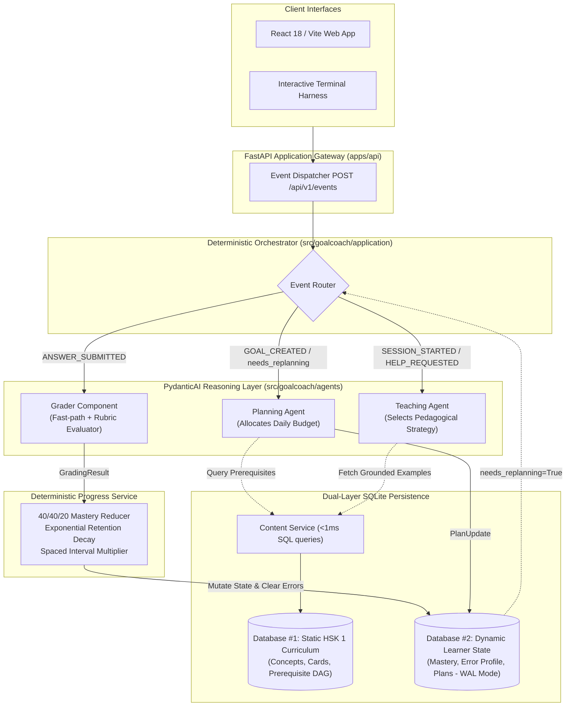

# GoalCoach

<div align="center">

[](https://github.com/Psyche0920/GoalCoach/actions/workflows/ci.yml)

[](LICENSE)
[](https://github.com/astral-sh/ruff)


**An adaptive, closed state-driven agentic learning coach for Chinese as a second language.**

[Key Features](#key-features) • [Architecture](#architecture) • [Dual Model Gateway](#dual-model-gateway) • [Quickstart](#quickstart) • [Verification Suite](#verification-suite) • [Contributing](CONTRIBUTING.md)

</div>

---

## Executive Overview

### The Problem with Conversational AI in Language Learning

Most AI language tutors operate as **stateless chatbots** or prompt-engineered conversational wrappers. While engaging, they fail as educational software:
- **Amnesia & Hallucination:** Conversational memory drifts across turns; the model cannot reliably track what has been mastered, what is decaying, or which errors are recurring.
- **Unbounded Context Bloat:** Stuffing dialogue transcripts into prompts burns tokens and introduces contradictory instructions without building an objective student model.
- **Absence of Pacing:** Chatbots cannot enforce curriculum progression or respect prerequisite dependency graphs (e.g., teaching complex question particles before basic pronouns).
- **No Scientific Spaced Repetition:** Retention decay, spaced review intervals, and remedial interventions require deterministic mathematical guarantees, not probabilistic LLM guesswork.

### The GoalCoach Paradigm: The Closed State-Driven Loop

GoalCoach replaces open-ended chatting with a **closed, state-driven agentic learning loop**:

```text
Goal -> Plan -> Teach -> Grade -> Update State -> Adapt -> Re-plan
```

1. **State as the Single Source of Truth:** Every learner interaction mutates a persistent relational state record in SQLite (mastery levels, retention curves, error taxonomies, spaced intervals).
2. **Deterministic Governance:** Routing events, updating mastery scores (40/40/20 reducer), calculating exponential retention decay, and checking prerequisite Directed Acyclic Graphs (DAG) are executed in pure, deterministic Python.
3. **Bounded Agent Autonomy:** [PydanticAI](https://github.com/pydantic/pydantic-ai) agents are utilized exclusively where open-ended pedagogical reasoning is required: deciding **how** to teach or **what** to sequence based on strictly typed schemas.
4. **Anti-Chain Architecture:** Sequential multi-agent chains (e.g., *Planner -> Retrieval -> Tutor -> Grader -> Progress*) on a single interaction turn are strictly prohibited to preserve sub-second responsiveness.

---

## Core Architectural Axioms

| Axiom | Engineering Invariant |
| :--- | :--- |
| **Axiom 1: Core Planning Proof** | **Same Goal + Different Learner State $\rightarrow$ Different Plan.** A student struggling with modal verbs receives remediation, while a student with high retention advances to new vocabulary. |
| **Axiom 2: Core Teaching Proof** | **Same Concept + Different Error History $\rightarrow$ Different Instructional Action.** A student confusing *le* (了) and *guo* (过) receives targeted contrast examples, not a repeated generic definition. |
| **Axiom 3: No Unbounded Memory** | Conversational chat logs do not represent mastery. Only verified database mutations drive progression. |
| **Axiom 4: Zero Sequential Chaining** | A single learner action invokes at most one reasoning agent or evaluator. State updates and non-urgent replanning occur out-of-band. |
| **Axiom 5: Grounded Curriculum** | All concept IDs, examples, and prerequisites are validated against the canonical HSK 1 relational database (Database #1) before persistence. |

---

## Architecture

GoalCoach cleanly decouples deterministic business rules and persistence from probabilistic AI reasoning workers:



### Event Routing & Execution Pipeline

- **`GOAL_CREATED`:** Triggers the **Planning Agent** to construct an initial curriculum roadmap and daily time-budgeted plan.
- **`SESSION_STARTED`:** Evaluates the active daily plan and invokes the **Teaching Agent** to deliver the immediate pedagogical action.
- **`ANSWER_SUBMITTED`:** Dispatches to the **Grader Component**, which runs an exact-match fast-path against curated answers before optionally calling the LLM rubric evaluator. The resulting `GradingResult` feeds into the **Progress Service**, which updates mastery, decays retention, logs or purges errors, and toggles `needs_replanning` if repeated errors occur.
- **`HELP_REQUESTED`:** Invokes the **Teaching Agent** to switch pedagogical modalities (from `EXPLANATION` to `HINT`, `CONTRAST_EXAMPLE`, or `RETRY`).

---

## Dual Model Gateway

GoalCoach is model-agnostic and interfaces with hosted or local models via an OpenAI-compatible adapter:

```text
┌─────────────────────────────────────────────────────────────┐
│                 PydanticAI Model Gateway                    │
├──────────────────────────────┬──────────────────────────────┤
│  Primary Hosted Model        │  Local Fallback (Ollama)    │
│  inclusionai/ling-3.0-flash-fin  hf.co/unsloth/gemma-4-E4B-it-GGUF:Q4_K_M │
│  (via OpenRouter / OpenAI)   │  or gemma-4-E2B-it-GGUF:Q4_K_M │
└──────────────────────────────┴──────────────────────────────┘
```

- **Primary Hosted Engine:** `inclusionai/ling-3.0-flash-fin` (via OpenRouter or direct API), selected for superior Chinese grammar instruction, pinyin accuracy, and low latency.
- **Resilient Local Fallback:** When remote connectivity fails or API rate limits are encountered, the system transparently fails over to a local Ollama instance running quantized GGUF weights (`hf.co/unsloth/gemma-4-E4B-it-GGUF:Q4_K_M` or `gemma-4-E2B-it-GGUF:Q4_K_M`).
- *Note:* The testing and benchmark harness is designed to evaluate additional models in subsequent phases.

---

## Key Features

- **HSK 1 Curriculum Grounding:** Curated relational database with 20 core grammatical concepts, 21 teaching cards, and 18 prerequisite relationships.
- **Anti-Stagnation Remediation Engine:** Hardened against infinite loops. Failed exercises dynamically rotate to alternative exercise IDs; remediating blocking prerequisites immediately unlocks downstream curriculum nodes.
- **Deterministic 40/40/20 Progress Reducer:** Computes overall mastery mathematically from concept coverage, exercise accuracy, and time-decayed retention.
- **Interactive CLI Terminal Harness:** A complete terminal interface (`terminal_harness.py`) providing instant, end-to-end interactive study sessions in the command line.
- **Unified REST API:** FastAPI application providing `/api/v1/events` for planning, teaching, help, grading, and replanning, plus `/health` monitoring.
- **Modern Web Application:** Standalone React 18 + Vite SPA with interactive Pinyin charts, visual progress roadmaps, and adaptive exercise modals.

---

## Quickstart

### Prerequisites
- **Python:** `3.12+` (or `>= 3.11`)
- **Package Manager:** [Astral `uv`](https://docs.astral.sh/uv/)
- **SQLite 3:** (Included with Python)
- **Node.js 18+:** (Optional, for web frontend)

### 1. Installation

```bash
# Clone the repository
git clone https://github.com/Psyche0920/GoalCoach.git
cd GoalCoach

# Synchronize dependencies with uv (creates virtual environment automatically)
uv sync --all-extras
```

### 2. Database Bootstrapping

GoalCoach relies on Database #1 for static curriculum content. Initialize it with SQLite:

```bash
mkdir -p data/database1
sqlite3 data/database1/goalcoach_hsk1_learning.db < GoalCoach_HSK1_Learning_DB_Package/data/goalcoach_hsk1_learning_db_sqlite.sql
```

*(Note: Pytest tests will automatically bootstrap this database via an autouse fixture if not present).*

### 3. Environment Configuration

Copy the sample environment file:

```bash
cp .env.example .env
```

Configure your LLM credentials in `.env`:

```ini
GOALCOACH_ENVIRONMENT=development
GOALCOACH_DATABASE_URL=sqlite:///./goalcoach.db
GOALCOACH_CONTENT_DATABASE_URL=sqlite:///./data/database1/goalcoach_hsk1_learning.db
# Keep prerequisite data/query interfaces available, but do not gate planning unless enabled.
GOALCOACH_ENABLE_PREREQUISITES=false

# Hosted Model (Primary)
GOALCOACH_LLM_BASE_URL=https://openrouter.ai/api/v1
GOALCOACH_LLM_API_KEY=your-api-key-here
GOALCOACH_LLM_MODEL="inclusionai/ling-3.0-flash-fin"

# Local Fallback (Ollama)
GOALCOACH_ENABLE_OLLAMA_FALLBACK=false
GOALCOACH_FALLBACK_LLM_BASE_URL=http://localhost:11434/v1
GOALCOACH_FALLBACK_LLM_MODEL=hf.co/unsloth/gemma-4-E4B-it-GGUF:Q4_K_M
```

---

## Running the Application

### Option A: Interactive CLI Terminal Harness

The fastest way to test the full teaching and grading loop without spinning up a browser:

```bash
uv run python -m src.goalcoach.agents.terminal_harness
```

### Option B: FastAPI Backend Server

Launch the backend REST API:

```bash
uv run uvicorn apps.api.main:app --reload --port 8000
```
- Interactive Swagger documentation: `http://localhost:8000/docs`
- Health check: `http://localhost:8000/health`

### Option C: Modern Web Application (React + Vite)

```bash
cd apps/web
npm install
npm run dev
```
Open `http://localhost:5173` to interact with the responsive visual learning dashboard.

---

## Verification Suite

The repository includes a comprehensive verification suite spanning fast unit tests, full closed-loop proofs, and strict code style checks.

```bash
# 1. Dependency lock verification
uv lock --check

# 2. Ruff code formatting check (0 diffs)
uv run ruff format --check src/ apps/ tests/

# 3. Ruff linter check (0 errors)
uv run ruff check src/ apps/ tests/

# 4. Fast Unit Tests (67 tests: domain models, math reducers, API routes)
uv run pytest tests/unit/ -v

# 5. End-to-End Closed Loop Integration Tests
GOALCOACH_ENVIRONMENT="testing" \
GOALCOACH_LLM_API_KEY="ci-mock-token" \
uv run pytest tests/integration/ -v
```

Deterministic unit and API tests run offline. Tests that exercise a configured remote model require its API credentials.

---

## Repository Layout

```text
.
├── .github/workflows/ci.yml       # GitHub Actions CI pipeline (lint, format, test, DB bootstrap)
├── apps/
│   ├── api/                       # FastAPI backend (routes, dependencies, event gateway)
│   └── web/                       # React 18 + Vite SPA
├── data/
│   └── database1/                 # Grounded HSK 1 curriculum SQLite database
├── docs/
│   ├── GOALCOACH_MVP_PRD.md       # Core MVP Product Requirements Document
│   └── dev/                       # Technical designs, remediation plans, and architecture audits
├── src/goalcoach/
│   ├── agents/                    # PydanticAI workers (Planning, Teaching, Grader, Terminal CLI)
│   ├── application/               # Deterministic Orchestrator & Progress Service (40/40/20 Reducer)
│   ├── domain/                    # Typed Pydantic models, schemas, and domain events
│   └── infrastructure/            # Dual-layer SQLite persistence, LLM gateway, and retrieval
├── tests/
│   ├── conftest.py                # Automated SQLite DB bootstrapping & test fixtures
│   ├── unit/                      # Fast unit tests for math, logic, and reducers
│   └── integration/               # End-to-end closed loop tests (AC1-AC11, remediation stress tests)
├── pyproject.toml                 # Project metadata, dependencies, and Ruff configuration
├── CHANGELOG.md                   # Chronological release and milestone history
├── CONTRIBUTING.md                # Developer setup, style guide, and PR guidelines
└── LICENSE                        # MIT License
```

---

## Documentation & References

- [Product Requirements Document (PRD)](docs/GOALCOACH_MVP_PRD.md)
- [Remediation Loop Bug Fix & Hardening Plan](docs/dev/REMEDIATION_LOOP_BUG_FIX_PLAN.md)
- [Closed Loop Audit & Comparison Report](docs/dev/CLOSED_LOOP_AUDIT_BEFORE_AFTER_COMPARISON.md)
- [Full-Stack Integration Walkthrough](docs/dev/FULL_STACK_INTEGRATION_PLAN_AND_WALKTHROUGH.md)

---

## Contributing

We welcome contributions! Please consult [CONTRIBUTING.md](CONTRIBUTING.md) for environment setup, coding guidelines, and pull request workflows.

---

## License

This project is licensed under the [MIT License](LICENSE) - see the LICENSE file for details.
