# GoalCoach — MVP Technical Product Requirements Document (PRD)

**Document Status:** Approved Core Baseline

**Target Stage:** Agentic AI MVP

**Curriculum Scope:** HSK 1

**System Topology:** Closed State-Driven Agentic Learning System

---

## 1. Executive Goal & Invariants

GoalCoach is an adaptive learning system, not an open-ended conversational chatterbot. Every learner interaction mutates persistent state, and that updated state directly determines future planning and pedagogical interventions.

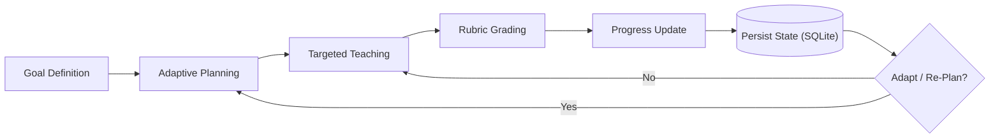

### Core Axioms

* **Core Success Criterion:** **Same goal + different learner state $\rightarrow$ different plan**.

* **No Unbounded Memory:** Conversational history does not represent student mastery; only deterministic database records drive progression.

* **System-Directed Learning:** The system actively drives review, remediation, and concept pacing rather than asking the user what they want to study.

---

## 2. Core Design Principles

1. **Agents Exclusively for Non-Deterministic Decisions:** Use PydanticAI reasoning agents strictly when open-ended contextual judgment is required (planning curriculum sequences and adapting instructional tactics).

2. **Deterministic Governance:** Event routing, state persistence, mastery mutations, retention decay calculations, prerequisite checks, and format validation remain 100% deterministic Python code.

3. **Event-Driven Architecture:** Interactions trigger explicit event dispatches; sequential multi-agent chains (e.g., Planner $\rightarrow$ Retrieval $\rightarrow$ Tutor $\rightarrow$ Grader $\rightarrow$ Progress) for a single interaction are strictly prohibited.

4. **Persistent State as Single Source of Truth:** The `LearnerState` stored in SQLite is authoritative.

5. **Curriculum-Bounded Operation:** The curriculum defines the upper bound of what can be taught; agents operate strictly within verified curriculum boundaries.

6. **Zero Heavy Vector DB Overload:** Vector search and external Vector DB (ChromaDB) are completely decommissioned; all concept and curriculum lookups execute deterministically via `ContentService` querying SQLite Database #1.

---

## 3. High-Level Architecture

The platform separates fast learner-facing response paths from state evaluation:

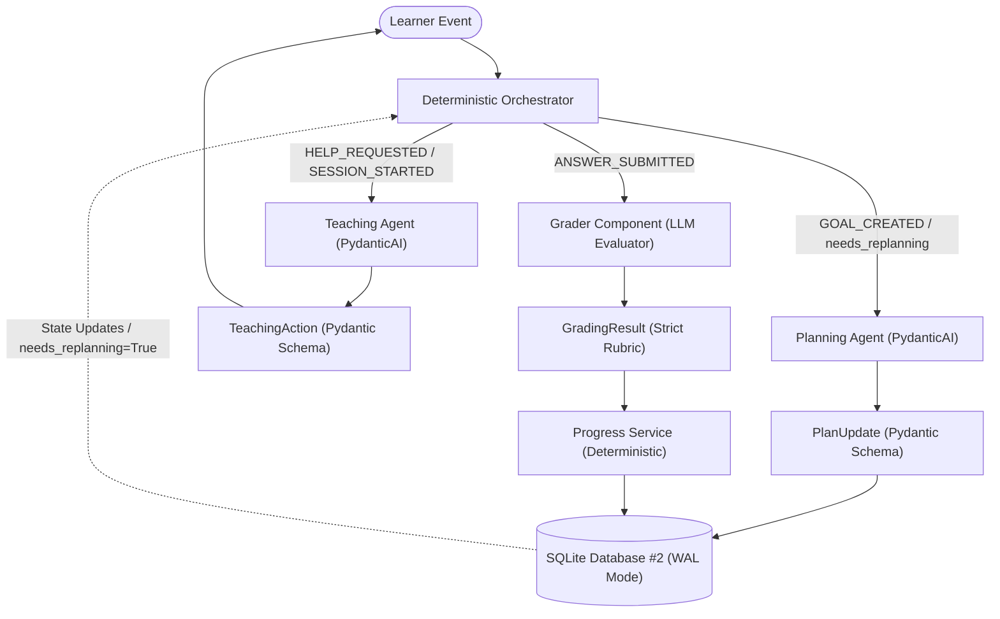

---

## 4. System Components & Responsibilities

| Component | Classification | Core Responsibility |
| --- | --- | --- |
| **Deterministic Orchestrator** | Pure Python Logic | Evaluates incoming events and routes them to the appropriate worker without invoking an LLM.|
| **Planning Agent** | PydanticAI Agent | Decides **what** the learner should do next based on goals, time budget, and historical weaknesses.|
| **Teaching Agent** | PydanticAI Agent | Decides **how** to teach the current concept right now based on past failed explanations and active error tags.|
| **Grader Component** | Stateless LLM Evaluator | Evaluates freeform answers against predefined rubric standards and gating conditions.|
| **Progress Service** | Deterministic Engine | Calculates retention decay, mastery deltas, mistake logging, and review schedules.|
| **Content Service** | Deterministic Engine | Provides sub-millisecond querying of concepts, examples, and prerequisite relations from Database #1.|
| **Repository Layer** | SQLAlchemy / aiosqlite | Encapsulates read/write operations for relational and serialized JSON domain states.|
| **SQLite DBs** | Relational Persistence | DB #1: Static HSK1 Curriculum. DB #2: Dynamic `LearnerState` in WAL mode.|

---

## 5. Event Routing Lifecycle

The Deterministic Orchestrator handles all incoming requests through an explicit priority map:

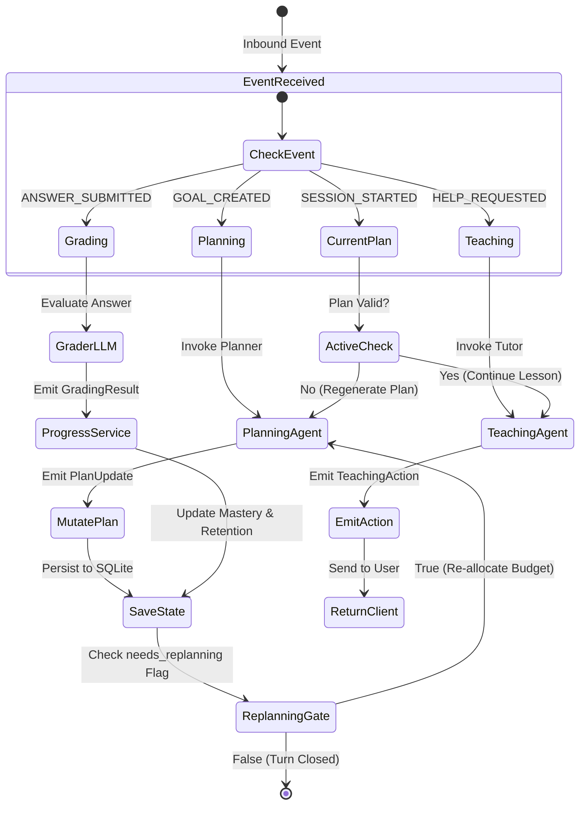

* **`needs_replanning` Lifecycle:** A state boolean flag, not an event. When the Progress Service flags repeated errors on the same concept, it sets `needs_replanning = True`. The Orchestrator intercepts this state and calls the Planning Agent to re-allocate today's session budget.

* **`HELP_REQUESTED` Context:** Emitted when a student indicates confusion (e.g., clicks "Coach Help" or inputs *"I don't get it"*). The Teaching Agent evaluates previous failed attempts and switches pedagogical strategies.

---

## 6. Curriculum / Teaching Materials Database

The Teaching Materials Database (Database #1: `goalcoach_hsk1_learning.db`) is the canonical, grounded knowledge source:

* **Concepts:** Concept IDs, canonical names, semantic definitions, level tags.

* **Reviewed Examples:** Bilingual character pairings with accurate Pinyin and audio markers.

* **Prerequisites:** Dependency graph mapping foundations to downstream rules.

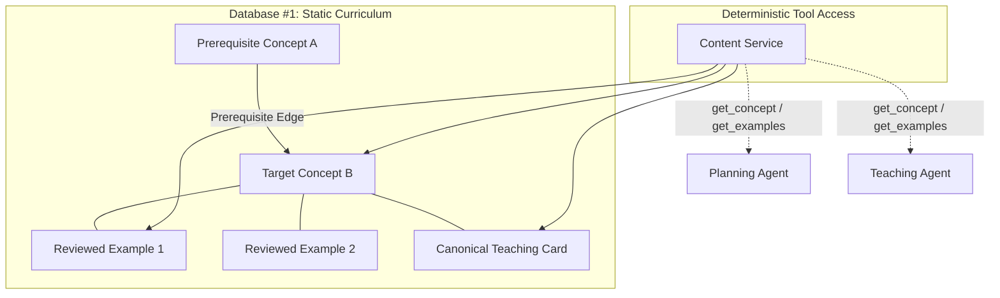

* **Relational Over Vector:** Because HSK1 contains 20 concepts, 21 cards, and 18 prerequisites, all lookups execute deterministically via SQL in $<1\text{ ms}$ without vector drift or embedding overhead.

* **Soft Prerequisites:** Prerequisites serve as **planning signals, not hard UI locks**. The Planning Agent may schedule prerequisite reinforcement without restricting free exploration.

---

## 7. Planning Agent Specification

**Core Question:** *"Given the current learner state and curriculum graph, what should the student do next?"*

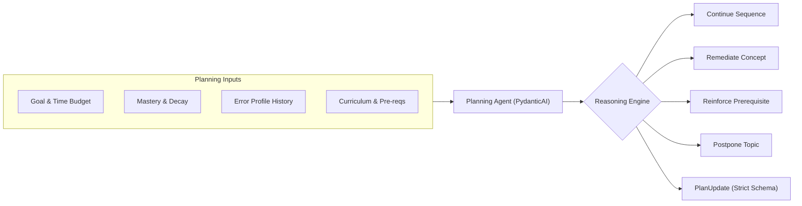

### Structured Output Schema: `PlanUpdate`

* `daily_allocation_minutes`: Total session duration (e.g., 20).

* `ordered_items`: Ordered list of tasks categorized into `REVIEW`, `REMEDIAL`, or `NEW`.

* `adaptation_rationale`: Transparent explanation of why this plan was selected.

* `roadmap_adjustments`: Concrete mutations applied to the student's macro roadmap.

### Execution Guardrails

* All emitted concept IDs are validated deterministically against Database #1 before persistence.

* Cumulative item durations must not exceed the student's active time budget.

* Failed schema validations trigger an automated PydanticAI repair loop without polluting application state.

---

## 8. Adaptive Roadmap & DailyPlan Modeling

The Roadmap provides a macro view of the curriculum, while the `DailyPlan` executes the immediate learning queue.

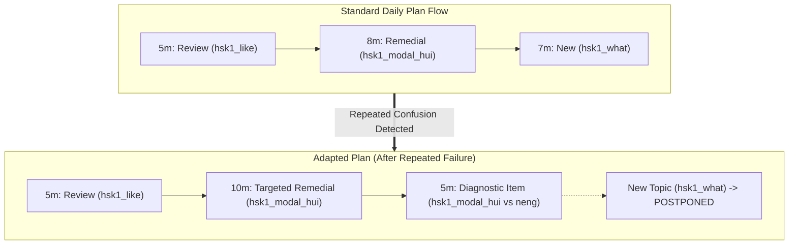

---

## 9. Teaching Agent Specification

**Core Question:** *"Given the active concept, learner error history, and failed attempts, how should we teach right now?"*

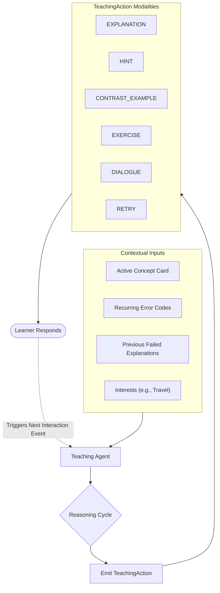

### Structured Output Schema: `TeachingAction`

* `action_kind`: Tag matching the pedagogical mode chosen (`EXPLANATION`, `HINT`, etc.).

* `concept_id`: Canonical curriculum tag being exercised.

* `content`: Bilingual explanation or instructional dialogue formatted with Pinyin.

* `pinyin`: Disambiguated tone readings for Hanzi characters.

* `exercise_payload`: Structured payload if the action presents an assessable problem.

---

## 10. Grader Component Specification

The Grader is an **isolated LLM evaluator, not an autonomous agent**. It assesses freeform user submissions against predefined rubric dimensions.

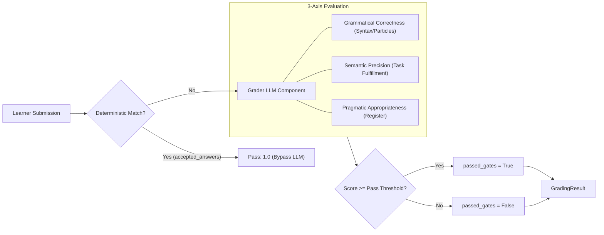

### Contract: `GradingResult`

* `passed_gates`: Boolean indicating whether core rubric minimums were satisfied.

* `scores`: Explicit float scores across evaluated axes ($[0.0, 1.0]$).

* `detected_errors`: List of standardized taxonomy codes (e.g., `ERR_QUESTION_MA`, `ERR_WORD_ORDER`).

* `feedback`: Targeted, factual feedback addressing the learner's specific mistake.

* *Note:* The Grader never calculates mastery; it only produces grading evidence.

---

## 11. Deterministic Progress Service

The Progress Service executes the mathematical transitions converting evaluation evidence into state updates:

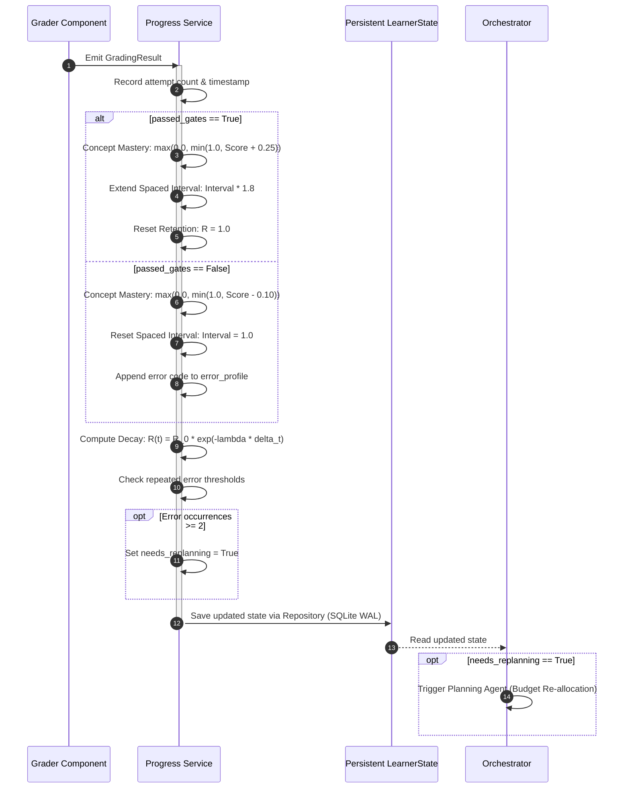

---

## 12. Persistent Learner State & Data Hierarchy

Persistent state is stored exclusively in **SQLite Database #2 (`goalcoach.db`) with WAL mode enabled**.

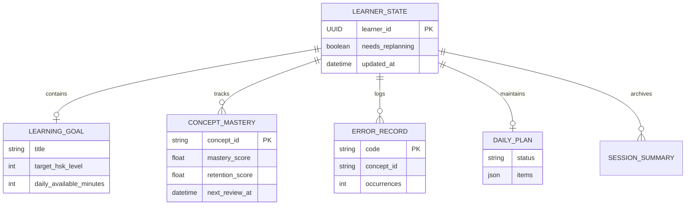

---

## 13. Service & Tool Access Pattern

Agents never communicate with external storage or execution environments directly; they interact through structured tool definitions:

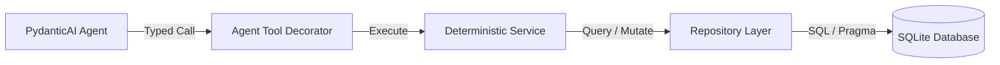

* **Agent Layer:** Houses reasoning logic, prompts, and output schema definitions.

* **Tool Layer:** Exposes typed function signatures with docstrings to guide model selection.

* **Service Layer:** Houses deterministic business rules (calculating progress and validating prerequisites).

* **Repository Layer:** Manages database sessions, connection pooling, and JSON column serialization.

---

## 14. Deterministic Content Service

The Content Service acts as the grounded gatekeeper for curriculum materials, replacing vector retrieval:

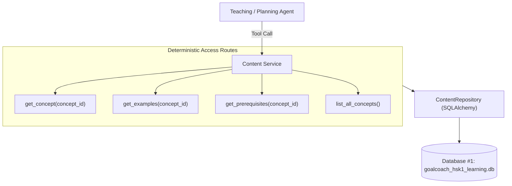

---

## 15. End-to-End Walkthrough

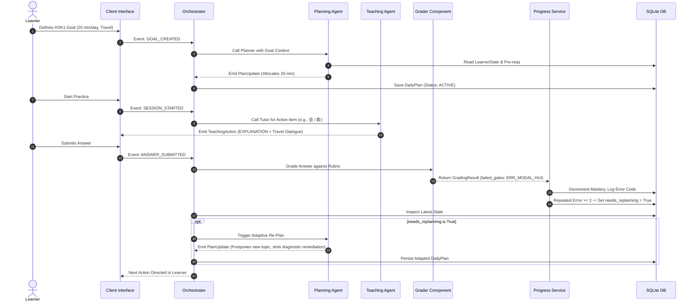

---

## 16. MVP Acceptance Criteria (100% Verified)

* [x] **AC1 — Closed Loop State Mutation:** User interactions successfully mutate persistent state records in SQLite (`tests/integration/test_closed_loop.py::test_ac1_ac7_closed_loop_state_mutation_and_durability`).
* [x] **AC2 — State-Conditioned Adaptation:** State changes dynamically alter subsequent planning allocations or instructional strategies (`tests/integration/test_closed_loop.py::test_ac2_ac10_core_planning_proof_same_goal_different_state`).
* [x] **AC3 — Structured Planning:** The Planning Agent outputs schema-validated `PlanUpdate` payloads.
* [x] **AC4 — Adaptive Strategy Switching:** The Teaching Agent selects alternative modalities (e.g., switching from explanation to contrast examples) when previous attempts fail (`tests/integration/test_closed_loop.py::test_ac4_ac11_core_teaching_proof_adaptive_strategy_switching`).
* [x] **AC5 — Rubric Enforcement:** The Grader evaluates submissions against predefined rubric standards and pass thresholds (`tests/integration/test_closed_loop.py::test_ac5_grader_fast_path_and_rubric`).
* [x] **AC6 — Deterministic Progress:** All progress calculations, retention decays, and mastery adjustments are executed by deterministic code (`tests/integration/test_closed_loop.py::test_ac6_progress_service_mathematical_invariants`).
* [x] **AC7 — Relational Persistence:** All learner data survives application restarts via SQLite WAL storage (`tests/integration/test_closed_loop.py::test_ac1_ac7_closed_loop_state_mutation_and_durability`).
* [x] **AC8 — Chain Elimination:** No sequential multi-agent LLM chain runs for a single user turn (`tests/integration/test_closed_loop.py::test_ac8_zero_sequential_agent_chaining`).
* [x] **AC9 — Observable Plan Shifts:** Agent decisions produce measurable changes in the daily task queue.
* [x] **AC10 — Core Planning Proof:** **Same goal + different learner state $\rightarrow$ different plan** (`tests/integration/test_closed_loop.py::test_ac2_ac10_core_planning_proof_same_goal_different_state`).
* [x] **AC11 — Core Teaching Proof:** **Same concept + different error history $\rightarrow$ different instructional action** (`tests/integration/test_closed_loop.py::test_ac4_ac11_core_teaching_proof_adaptive_strategy_switching`).

### Remediation Engine Invariants (Stress-Tested)
- **Anti-Stagnation Guarantee:** Remedial exercise rotation ensures that a learner never loops endlessly on the same exercise ID (`test_remediation_exercise_rotates_and_does_not_repeat_e01`).
- **Prerequisite DAG Unlocking:** Remediating an upstream blocking concept immediately unlocks downstream unready concepts (`test_edge_case_prerequisite_dag_blocks_unready_and_unlocks_remediated`).
- **Error Profile Resolution:** Successful remediation purges resolved errors from `error_profile` and resets `needs_replanning` without Pydantic schema validation failures (`test_remediation_success_clears_error_profile_and_resets_replanning`).

---

## 17. Telemetry & Observability

To maintain engineering visibility, the system records the following structured parameters for every agent execution:

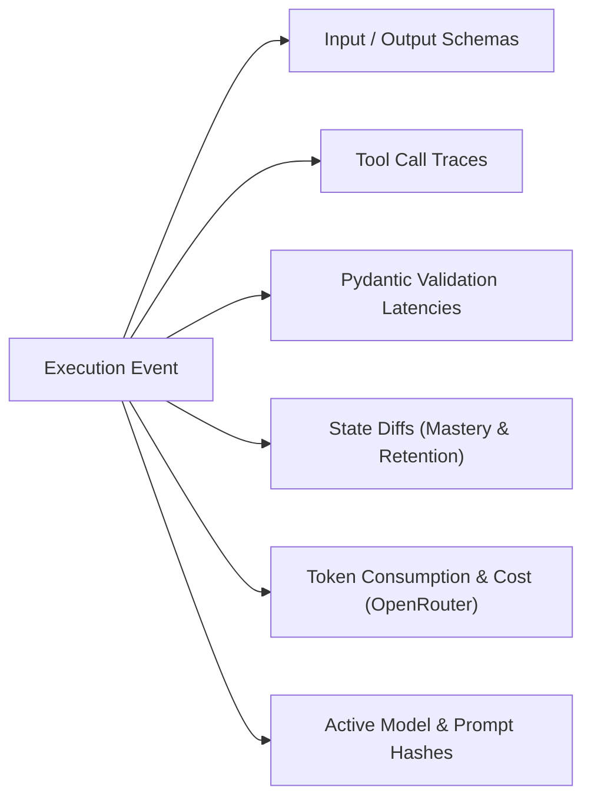

---

## 18. Deferred Implementation Items (TBD)

* Exact mathematical retention decay constant $\lambda$ and spaced multiplier parameters.

* Production rubric weighting across grammatical, semantic, and pragmatic axes.

* Final grading pass threshold values.

* Session conversation transcript retention policy and pruning strategy.

* Expansion of curriculum content past HSK1.