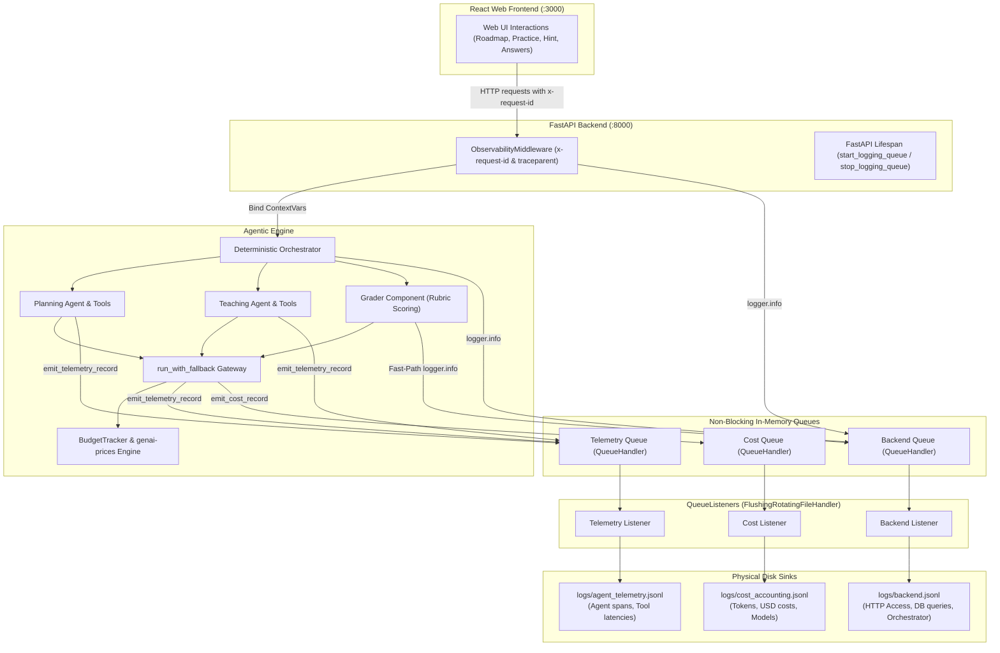

# GoalCoach Enterprise Observability & Telemetry Guide

Welcome to the GoalCoach Observability, Telemetry, and Cost Accounting Guide. This document provides a comprehensive manual on how the logging and telemetry architecture functions, how to run and verify it, how to analyze agent performance and financial spend, and specifically how to operate the system so that every user interaction in the React frontend is logged to disk in real time.

---

## 1. Architectural Overview: The Isolated Logging Triad

GoalCoach operates an asynchronous, non-blocking telemetry architecture that strictly separates operational system events, agent lifecycle spans, and financial ledger data into three append-only, newline-delimited JSON (**NDJSON**) sinks located in the `logs/` directory:



### The Three Log Sinks Explained

| Log File | Logger Hierarchy | Propagation | Purpose & Payload |
| :--- | :--- | :--- | :--- |
| `logs/backend.jsonl` | `goalcoach.backend`, `goalcoach`, `apps.api` | Filtered | General operational telemetry: HTTP request routes, response codes, latency, SQLite database queries, and orchestrator state machine events. |
| `logs/agent_telemetry.jsonl` | `goalcoach.agent.telemetry` | `propagate = False` | Detailed agent spans: Lifecycle stages (`started`, `tool_called`, `tool_returned`, `completed`, `failed`), individual tool latency in ms, and retry attempts. |
| `logs/cost_accounting.jsonl` | `goalcoach.agent.cost` | `propagate = False` | Granular financial ledger: Exact input tokens, output tokens, cached tokens, model names, providers, and calculated USD costs per LLM execution. |

> [!IMPORTANT]
> `goalcoach.agent.telemetry` and `goalcoach.agent.cost` operate with `propagate = False`. This guarantees **zero cross-sink pollution**: financial metrics and tool spans will never pollute your backend application logs.

---

## 2. Using Logging with the React Web Frontend

Previously, you may have noticed that interactions in the web app did not appear immediately in the log files. This section explains why that occurred, how it was resolved, and step-by-step instructions to run the frontend and backend together with real-time log streaming.

### Why Logging Failed Under the Web App (Root Causes Fixed)

1. **OS File Buffering:** Standard Python `FileHandler` buffers writes in operating system memory. In short-lived CLI tasks, the buffer flushes when the program exits. In a long-running web server (like Uvicorn), logs remained trapped in memory buffers. We replaced this with `FlushingRotatingFileHandler`, which calls `self.flush()` after every single emitted record.
2. **Current Working Directory (CWD) Drift:** When launching Uvicorn from subdirectories or IDEs, relative paths like `./logs/` pointed to different locations or failed silently. We implemented `Settings.resolve_log_path()`, which anchors all log paths relative to the canonical project repository root.
3. **QueueListener Thread Duplication:** Calling `start_logging_queue()` repeatedly caused duplicate monitor threads in Python's standard `QueueListener`, causing shutdowns to hang. We implemented an atomic `_started` guard in `CompoundListener`.
4. **Context Loss Across Async Worker Threads:** Context variables (like `x-request-id` from web requests) were being cleared on consumer threads. We attached the `ContextFilter` to the producer queue handlers so request IDs are captured at emission time.

---

### Step-by-Step: Running with the Web App & Live Streaming

To use GoalCoach with the web frontend and verify that every click logs in real time, open two or three terminal windows:

#### Terminal 1: Start the FastAPI Backend
From the repository root:
```powershell
# Windows PowerShell
uv run uvicorn apps.api.main:app --port 8000 --reload
```
```bash
# Linux / macOS
uv run uvicorn apps.api.main:app --port 8000 --reload
```

*What happens on startup:*
- The FastAPI `lifespan` triggers `configure_logging()` and `start_logging_queue()`.
- The physical directory `logs/` and files `backend.jsonl`, `agent_telemetry.jsonl`, and `cost_accounting.jsonl` are initialized.
- Uvicorn begins listening on `http://127.0.0.1:8000`.

#### Terminal 2: Start the React Frontend
From the repository root:
```powershell
# Windows PowerShell or Linux
npm --prefix apps/web run dev
```
- The Vite development server starts at `http://localhost:3000`.
- All requests to `/api` or `/health` are automatically proxied to the backend at `http://127.0.0.1:8000`.

#### Terminal 3: Stream the Logs in Real Time
Open a third terminal window to watch the logs appear as you use the browser:

```powershell
# Windows PowerShell (Live streaming the backend operational log)
Get-Content -Wait -Tail 10 logs/backend.jsonl
```
```bash
# Linux / macOS (Live streaming all 3 logs side-by-side)
tail -f logs/backend.jsonl logs/agent_telemetry.jsonl logs/cost_accounting.jsonl
```

#### Browser Actions to Test:
1. Open `http://localhost:3000` in Google Chrome or your preferred browser.
2. **Create a Goal / Start Session:**
   - Watch `logs/backend.jsonl` immediately record the inbound `POST /api/v1/events` (`GOAL_CREATED`) with status `200`.
   - Watch `logs/agent_telemetry.jsonl` record the `planning_agent` moving from `started` to `completed`.
3. **Answer a Practice Question:**
   - Submit an answer in the learning modal.
   - If the answer is an exact match, `logs/backend.jsonl` logs `Grader resolved via deterministic-fast-path (<5ms)`.
   - If evaluated by the LLM, `logs/cost_accounting.jsonl` logs the exact input/output tokens and USD cost of the grading call.
4. **Ask for Help / Hint:**
   - Click "Need Help" or ask for a hint.
   - `logs/agent_telemetry.jsonl` records Coach Baobao's `teaching_agent` executing tools and choosing an empathetic hint modality.

---

## 3. How to Test the Logging System via CLI

In addition to the web app, you can test and inspect the logging pipeline directly using CLI commands.

### Option A: Non-Interactive Headless Smoke Test
To test the entire agentic loop and produce sample entries in all three log files without manual typing:
```powershell
uv run python -m goalcoach.agents.terminal_harness --test-mode
```
This runs 1 complete cycle:
1. Creates goal and generates daily plan.
2. Invokes Coach Baobao for the first practice item with full Unicode Chinese rendering.
3. Automatically submits simulated practice answers.
4. Evaluates submissions against rubrics.
5. Flushes all background queues to disk and cleanly exits.

### Option B: Interactive CLI Study Session
To run the interactive study session while logging in the background:
```powershell
# Clean terminal UI (logs go quietly to logs/ in background)
uv run goalcoach

# Verbose terminal UI (logs stream to console in ANSI color while you practice)
uv run goalcoach --verbose
```

### Option C: Automated Observability & Isolation Test Suite
Run the automated verification suite to verify that loggers are strictly isolated and that the web logging pipeline functions properly:
```powershell
uv run pytest tests/unit/test_logging_isolation.py tests/api/test_web_logging_pipeline.py -v
```

---

## 4. How to Read and Understand the Logs

Every log entry in GoalCoach is formatted as a single-line JSON object (NDJSON) containing structured metadata.

### 1. Backend Operational Log (`logs/backend.jsonl`)

Used for troubleshooting HTTP requests, database performance, and application routing.

```json
{
  "timestamp": "2026-10-01T21:14:28.257123+00:00",
  "level": "INFO",
  "logger": "apps.api.access",
  "message": "HTTP POST /api/v1/events 200 (36.81ms)",
  "context": {
    "request_id": "web-corr-id-998877",
    "trace_id": "ca2013e6447d43c08f414ccf4b885e58",
    "learner_id": "web-learner-001"
  },
  "extra": {
    "http.method": "POST",
    "http.route": "/api/v1/events",
    "http.status_code": 200,
    "duration_ms": 36.81,
    "client_ip": "127.0.0.1"
  }
}
```

**Key Fields to Check:**
- `context.request_id`: The correlation ID passed from the frontend via the `x-request-id` header.
- `extra.duration_ms`: Server-side processing latency in milliseconds.
- `extra.http.status_code`: HTTP response status code (e.g., `200`, `422`, `500`).

---

### 2. Agent Telemetry Log (`logs/agent_telemetry.jsonl`)

Used for profiling agent execution times, tracking tool usage, and analyzing failure rates.

```json
{
  "event_id": "8d3e2303-128b-4940-b384-cb91924b1234",
  "trace_id": "web-corr-id-998877",
  "run_id": "web-corr-id-998877",
  "parent_run_id": null,
  "agent_name": "planning_agent",
  "stage": "completed",
  "learner_id": "web-learner-001",
  "concept_id": null,
  "tool_name": null,
  "tool_latency_ms": null,
  "execution_latency_ms": 12.32,
  "error_message": null,
  "metadata": {
    "item_count": 4,
    "daily_allocation_minutes": 20,
    "provider": "deterministic"
  },
  "timestamp": "2026-10-01T21:14:28.250000+00:00"
}
```

**Key Fields to Check:**
- `stage`: Lifecycle stage (`started`, `tool_called`, `tool_returned`, `completed`, `failed`).
- `tool_name` & `tool_latency_ms`: When `stage` is `tool_returned`, records the exact duration of catalog or prerequisite lookup queries.
- `execution_latency_ms`: Total execution time of the agent in milliseconds.
- `metadata`: Agent-specific metadata (e.g., number of plan items scheduled, fallback notice, error details).

---

### 3. Financial Cost Accounting Log (`logs/cost_accounting.jsonl`)

Used for audit-proof LLM cost tracking, token usage accounting, and model budget control.

```json
{
  "record_id": "a671cf47-080c-4bc7-9bb3-9ce659ee7f51",
  "trace_id": "web-corr-id-998877",
  "run_id": "web-corr-id-998877",
  "learner_id": "web-learner-001",
  "agent_name": "teaching_agent",
  "provider": "openrouter",
  "model_name": "deepseek/deepseek-chat",
  "prompt_tokens": 220,
  "completion_tokens": 65,
  "cached_tokens": 0,
  "total_tokens": 285,
  "input_cost_usd": 0.00031,
  "output_cost_usd": 0.00010,
  "total_cost_usd": 0.00041,
  "is_fallback": false,
  "budget_exceeded": false,
  "cumulative_session_cost_usd": 0.00041,
  "timestamp": "2026-10-01T21:14:28.247887+00:00"
}
```

**Key Fields to Check:**
- `total_cost_usd`: Exact dollar cost calculated via live pricing (`genai-prices`).
- `cumulative_session_cost_usd`: Running financial total for the learner's active session.
- `budget_exceeded`: Set to `true` if the session exceeded the safety budget threshold configured in `Settings.session_cost_limit_usd` (default: `$0.50`).
- Local Ollama executions automatically record `$0.000000` with `is_fallback: true`.

---

## 5. Analyzing Logs with the Dual-Engine Analytics Scripts

GoalCoach includes two built-in CLI analytics tools located in the `scripts/` directory. They support a **Dual-Engine** architecture: they automatically leverage **DuckDB** for high-speed columnar queries if installed, and automatically fall back to Python standard library modules (`json`, `collections`, `statistics`) if DuckDB is not present.

### 1. Cost Accounting Analysis (`scripts/analyze_agent_costs.py`)

Run this script to inspect aggregate spend, token counts, and costs broken down by agent and model:

```powershell
uv run python scripts/analyze_agent_costs.py
```

*Example Output:*
```text
======================================================================
 GOALCOACH AGENT COST ACCOUNTING REPORT (Engine: Python Stdlib)
 Source: logs\cost_accounting.jsonl
======================================================================
 Total LLM Calls:       12
 Total Input Tokens:    8,420
 Total Output Tokens:   2,150
 Total Tokens:          10,570
 Total Cost:            $0.014280 USD
----------------------------------------------------------------------

COST & TOKENS BY AGENT:
Agent Name                   Calls   Total Tokens     Cost (USD)
-----------------------------------------------------------------
teaching_agent                   8          6,400 $     0.009600
grader_component                 3          2,820 $     0.003480
planning_agent                   1          1,350 $     0.001200

COST & TOKENS BY PROVIDER / MODEL:
Provider        Model Name                   Calls       Tokens   Cost (USD)
----------------------------------------------------------------------------
openrouter      deepseek/deepseek-chat          12       10,570 $   0.014280
======================================================================
```

You can also pass a custom log path:
```powershell
uv run python scripts/analyze_agent_costs.py --file path/to/custom_costs.jsonl
```

---

### 2. Agent Telemetry Analysis (`scripts/analyze_agent_telemetry.py`)

Run this script to calculate execution latencies, percentile breakdowns (P50, P90, P99), tool performance, and failure rates:

```powershell
uv run python scripts/analyze_agent_telemetry.py
```

*Example Output:*
```text
================================================================================
 GOALCOACH AGENT TELEMETRY REPORT (Engine: Python Stdlib)
 Source: logs\agent_telemetry.jsonl
================================================================================
 Total Events Logged:   38
 Unique Traces:         14
 Unique Agent Runs:     14
--------------------------------------------------------------------------------

LIFECYCLE STAGE DISTRIBUTION:
  • tool_returned            16 events ( 42.1%)
  • tool_called              16 events ( 42.1%)
  • completed                 4 events ( 10.5%)
  • started                   2 events (  5.3%)

AGENT EXECUTION LATENCIES (ms):
Agent Name             Runs  Fails   Avg (ms)      P50      P90      P99      Max
--------------------------------------------------------------------------------
teaching_agent            8      0      24.12    22.40    31.50    38.00    38.00
planning_agent            4      0      12.30    11.80    15.20    16.10    16.10

TOOL CALL PERFORMANCE (ms):
Tool Name                         Calls   Avg (ms)      P50      P90      Max
----------------------------------------------------------------------------
get_concept_teaching_cards            8       0.45     0.40     0.60     0.75
get_curriculum_catalog                4       1.20     1.10     1.50     1.80
get_concept_prerequisites             4       0.30     0.28     0.42     0.50
================================================================================
```

---

## 6. Configuration Reference (`Settings`)

All logging behavior is centrally configured in [`goalcoach.infrastructure.config.Settings`](file:///C:/Users/musab/Documents/GoalCoach/src/goalcoach/infrastructure/config.py) and can be customized via `.env` environment variables:

| Setting Field | Environment Variable | Default Value | Description |
| :--- | :--- | :--- | :--- |
| `backend_log_path` | `GOALCOACH_BACKEND_LOG_PATH` | `./logs/backend.jsonl` | Physical path for operational backend access logs. |
| `agent_telemetry_log_path` | `GOALCOACH_AGENT_TELEMETRY_LOG_PATH` | `./logs/agent_telemetry.jsonl` | Physical path for agent lifecycle and tool telemetry. |
| `cost_accounting_log_path` | `GOALCOACH_COST_ACCOUNTING_LOG_PATH` | `./logs/cost_accounting.jsonl` | Physical path for financial token accounting logs. |
| `session_cost_limit_usd` | `GOALCOACH_SESSION_COST_LIMIT_USD` | `0.50` | Maximum allowable spend per learner session before triggering circuit breaker. |
| `async_logging_queue_size` | `GOALCOACH_ASYNC_LOGGING_QUEUE_SIZE` | `10000` | In-memory queue buffer size per sink. |
| `offline_llm_fallback` | `GOALCOACH_OFFLINE_LLM_FALLBACK` | `true` | When true, skips external API calls and uses deterministic curriculum fallbacks ($0 spend). |
| `log_slow_query_threshold_ms` | `GOALCOACH_LOG_SLOW_QUERY_THRESHOLD_MS` | `25.0` | Queries exceeding this threshold emit a `WARN` alert. |

---

## 7. Troubleshooting & FAQs

### Q: Why is `logs/cost_accounting.jsonl` empty?
**A:** By default, `GOALCOACH_OFFLINE_LLM_FALLBACK=true` is enabled in development, which executes deterministic fallbacks without incurring LLM charges ($0 spend). When an LLM model (OpenRouter or OpenAI) is actively invoked with an API key, cost records will immediately appear here.

### Q: How can I verify that log records are flushing without buffering?
**A:** Use `Get-Content -Wait -Tail 5 logs/backend.jsonl` in PowerShell or `tail -f logs/backend.jsonl` in Linux/macOS. As soon as you click any button in the web frontend, you will see the JSON line appear instantly in your terminal.

### Q: Are sensitive credentials sanitized?
**A:** Yes. The `SecretScrubbingFilter` inspects all logged text, messages, and dictionary arguments. Any pattern matching an API key (e.g. `sk-or-v1-...`, `Bearer ...`) is automatically substituted with `***REDACTED***` prior to writing to disk.
