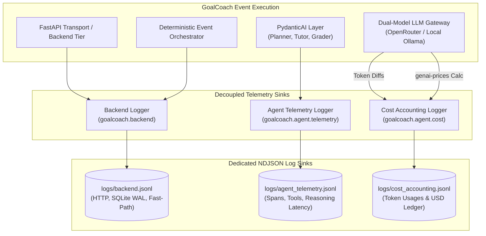

# Feature Implementation Plan: Deep Agent Telemetry & Cost Accounting Logging System

### Executive Architecture Audit & Current Codebase Analysis

The GoalCoach repository utilizes a dual-database architecture: Database #1 (`goalcoach_hsk1_learning.db`) for static curriculum and Database #2 (`goalcoach.db` with SQLite WAL mode) for mutable learner states. Workflow governance is driven by a deterministic Python orchestrator that dispatches to three specialized workers: the Planning Agent, the Teaching Agent, and the stateless Grader Component.

In the current codebase, general runtime logs (such as database slow queries, SQLite lock contentions, model fallback triggers, and basic HTTP lifecycle entries) write to a single log sink (`logs/goalcoach.jsonl`). Inspecting `uv.lock` reveals existing dependencies for `genai-prices` (0.1.6), `logfire` (5.0.0), `opentelemetry-api` (1.43.0), and `pydantic-ai` (1.30.1).

#### Architectural Problem Statement

1. **Coupled Logging Sinks:** Conflating operational backend logs (HTTP responses, database WAL timings) with agent token emissions and model inference traces causes high noise, complicates DuckDB analytics, and hinders billing audits.


2. **Missing Granular Cost Ledger:** While inference fallbacks between OpenRouter API remote models and local Ollama (`unsloth/gemma-4-E4b-it-GGUF`) are operational, the system lacks token-level cost accounting, exact prompt/completion pricing, tool-execution latency measurement, and per-session financial ceilings.


3. **Decoupling Requirement:** Backend logging must run via an isolated logger hierarchy and output to `logs/backend.jsonl`, while Agent Telemetry and Cost Accounting must operate through completely separate channels writing to `logs/agent_telemetry.jsonl` and `logs/cost_accounting.jsonl` respectively, with log propagation (`propagate=False`) strictly disabled between them.

---



---

### 1. Invariants & Architectural Guardrails

* **Strict Logger Isolation:** Backend logging (`goalcoach.backend`), Agent Telemetry (`goalcoach.agent.telemetry`), and Cost Accounting (`goalcoach.agent.cost`) must have distinct logger instances with `propagate = False`. Agent runs must never emit into the backend stream, and backend errors must never enter the cost ledger.
* **Deterministic Cost Computation:** All dollar calculations must use `genai-prices` for OpenRouter models. Local Ollama inference costs must resolve deterministically to exactly `$0.00000000`.


* **Zero `.env` Access:** All telemetry file paths, buffer thresholds, and budget limits must resolve strictly via `src/goalcoach/infrastructure/config.py` using `pydantic-settings`.


* **Zero Latency Impact on Interactive Loop:** File logging must execute asynchronously or via non-blocking, queued handlers (`logging.handlers.QueueHandler`) so student response latencies remain strictly $<1\text{ s}$.


* **Structured NDJSON Schema Compliance:** Every log entry must validate against explicit Pydantic v2 domain schemas before emission.

---

### 2. File System Target Layout

```text
GoalCoach/
├── src/goalcoach/
│   ├── infrastructure/
│   │   ├── config.py                               # MODIFIED: Add telemetry paths & budget ceilings
│   │   ├── logging/
│   │   │   ├── __init__.py                         # NEW: Export loggers and setup utilities
│   │   │   ├── formatters.py                       # NEW: Structured JSON (NDJSON) formatter
│   │   │   ├── sinks.py                            # NEW: Isolated queue-backed file sinks
│   │   │   └── cost_calculator.py                  # NEW: genai-prices calculator with Ollama zero-cost
│   │   └── llm/
│   │       ├── gateway.py                          # MODIFIED: Intercept token counts & emit cost logs
│   │       └── pydantic_ai_models.py               # MODIFIED: Wrap runs with AgentTelemetry spans
│   ├── domain/
│   │   └── telemetry.py                            # NEW: Pydantic v2 schemas for telemetry & cost records
│   └── agents/
│       ├── planning_agent.py                       # MODIFIED: Instrument run lifecycle & tool calls
│       ├── teaching_agent.py                       # MODIFIED: Instrument pedagogical actions & latency
│       └── grader_component.py                     # MODIFIED: Instrument fast-path vs LLM evaluation
├── scripts/
│   ├── analyze_agent_costs.py                      # NEW: DuckDB audit script for token usage & cost ledger
│   └── analyze_agent_telemetry.py                  # NEW: DuckDB script for reasoning steps & tool errors
└── tests/
    └── unit/
        ├── test_cost_accounting.py                 # NEW: Unit tests for genai-prices calculator
        └── test_logging_isolation.py               # NEW: Tests verifying zero cross-sink pollution

```

---

### 3. Telemetry & Cost Domain Schemas (`src/goalcoach/domain/telemetry.py`)

```python
from __future__ import annotations

from datetime import datetime, timezone
from enum import StrEnum
from typing import Any
from uuid import UUID, uuid4
from pydantic import BaseModel, Field

def utc_now() -> datetime:
    return datetime.now(timezone.utc)

class AgentLifecycleStage(StrEnum):
    STARTED = "started"
    TOOL_CALLED = "tool_called"
    TOOL_RETURNED = "tool_returned"
    COMPLETED = "completed"
    FAILED = "failed"

class AgentTelemetryRecord(BaseModel):
    """Event emitted exclusively to logs/agent_telemetry.jsonl."""
    event_id: UUID = Field(default_factory=uuid4)
    trace_id: str
    run_id: str
    parent_run_id: str | None = None
    agent_name: str
    stage: AgentLifecycleStage
    learner_id: UUID | None = None
    concept_id: str | None = None
    tool_name: str | None = None
    tool_latency_ms: float | None = None
    execution_latency_ms: float | None = None
    error_message: str | None = None
    metadata: dict[str, Any] = Field(default_factory=dict)
    timestamp: datetime = Field(default_factory=utc_now)

class CostAccountingRecord(BaseModel):
    """Financial ledger record emitted exclusively to logs/cost_accounting.jsonl."""
    record_id: UUID = Field(default_factory=uuid4)
    trace_id: str
    run_id: str
    learner_id: UUID | None = None
    agent_name: str
    provider: str  # "openrouter" or "ollama"
    model_name: str
    prompt_tokens: int = Field(ge=0)
    completion_tokens: int = Field(ge=0)
    cached_tokens: int = Field(default=0, ge=0)
    total_tokens: int = Field(ge=0)
    input_cost_usd: float = Field(ge=0.0)
    output_cost_usd: float = Field(ge=0.0)
    total_cost_usd: float = Field(ge=0.0)
    is_fallback: bool = False
    budget_exceeded: bool = False
    timestamp: datetime = Field(default_factory=utc_now)

```

---

### 4. Step-by-Step Implementation Roadmap

#### Phase 1: Configuration & Domain Schema Declaration

1. **Update Settings (`src/goalcoach/infrastructure/config.py`)**:
* Add telemetry parameters:


```python
backend_log_path: str = "./logs/backend.jsonl"
agent_telemetry_log_path: str = "./logs/agent_telemetry.jsonl"
cost_accounting_log_path: str = "./logs/cost_accounting.jsonl"
session_cost_limit_usd: float = 0.50
enable_agent_telemetry: bool = True

```


2. **Create Domain Models (`src/goalcoach/domain/telemetry.py`)**:
* Implement `AgentTelemetryRecord` and `CostAccountingRecord` with strict Pydantic v2 validations.


#### Phase 2: Decoupled Multi-Sink Logging Infrastructure

1. **Implement JSON Formatter (`src/goalcoach/infrastructure/logging/formatters.py`)**:
* Build `NDJSONFormatter` that extracts `record.msg` if already a valid Pydantic model or formats dictionary payloads into uniform single-line JSON.


2. **Implement Sinks & Logger Manager (`src/goalcoach/infrastructure/logging/sinks.py`)**:
* Initialize three dedicated loggers:
* `backend_logger`: Bound to `logs/backend.jsonl`.
* `agent_telemetry_logger`: Bound to `logs/agent_telemetry.jsonl`, `propagate = False`.
* `cost_logger`: Bound to `logs/cost_accounting.jsonl`, `propagate = False`.


* Configure asynchronous non-blocking logging using `QueueHandler` and `QueueListener`.
* Ensure directory `./logs` is auto-created with verified filesystem permissions.


#### Phase 3: Cost Accounting Engine (`genai-prices` Integration)

1. **Implement Calculator (`src/goalcoach/infrastructure/logging/cost_calculator.py`)**:
* Integrate `genai-prices` to calculate token pricing.


* Define price resolver:
```python
class CostCalculator:
    @staticmethod
    def calculate(provider: str, model: str, prompt_tokens: int, completion_tokens: int, cached_tokens: int = 0) -> tuple[float, float, float]:
        if provider.lower() == "ollama":
            return 0.0, 0.0, 0.0
        # Leverage genai_prices for OpenRouter models
        # Fallback to predefined rate card if model identifier not matched
        ...

```


2. **Unit Tests (`tests/unit/test_cost_accounting.py`)**:
* Verify Ollama models always return `$0.0`.
* Verify OpenRouter models compute correct float precision values for prompt, completion, and total costs.


#### Phase 4: Agent & Gateway Instrumentation

1. **Instrument Gateway (`src/goalcoach/infrastructure/llm/gateway.py` or `pydantic_ai_models.py`)**:
* Capture usage metadata from model response objects (`usage.prompt_tokens`, `usage.completion_tokens`).


* Calculate cost via `CostCalculator`.
* Construct `CostAccountingRecord` and emit directly to `cost_logger`.
* If accumulated session cost exceeds `session_cost_limit_usd`, set `budget_exceeded = True` and emit a warning to `backend_logger`.


2. **Instrument Agents (`planning_agent.py`, `teaching_agent.py`, `grader_component.py`)**:
* Wrap agent invocations with telemetry tracers emitting `AgentLifecycleStage.STARTED` and `AgentLifecycleStage.COMPLETED` to `agent_telemetry_logger`.


* Wrap tool calls (`get_concept`, `get_examples`, `get_prerequisites`) to record tool name and `tool_latency_ms`.


* Ensure the Grader Component's deterministic fast-path evaluation emits only a backend operational record and does NOT log any agent model inference or cost records.


#### Phase 5: DuckDB Analytics & Audit Scripting

1. **Cost Audit Script (`scripts/analyze_agent_costs.py`)**:
* Write standalone DuckDB SQL script querying `logs/cost_accounting.jsonl`:


* Total spend grouped by agent (`planning_agent` vs `teaching_agent` vs `grader`).


* Total tokens and costs grouped by provider (`openrouter` vs `ollama`).


* Top 10 most expensive traces and average cost per learner session.


2. **Telemetry Audit Script (`scripts/analyze_agent_telemetry.py`)**:
* Write DuckDB script querying `logs/agent_telemetry.jsonl`:


* Average tool execution latency grouped by tool name.
* Agent error rate and tool failure counts.
* P95 agent reasoning latency.


---

### 5. Verification & Acceptance Directives for Coding Agent

Execute the following commands sequentially to validate that isolation and calculations work as specified:

```bash
# 1. Format and lint checks
uv run ruff check src/goalcoach/ tests/unit/ scripts/
uv run ruff format --check src/goalcoach/ tests/unit/ scripts/

# 2. Run unit tests for cost calculation and logger isolation
uv run pytest tests/unit/test_cost_accounting.py tests/unit/test_logging_isolation.py -v

# 3. Execute synthetic single-session run to generate logs
uv run python -m goalcoach.agents.terminal_harness --test-mode

# 4. Verify physical isolation of log sinks (all three files must exist and be non-empty)
test -s logs/backend.jsonl
test -s logs/agent_telemetry.jsonl
test -s logs/cost_accounting.jsonl

# 5. Verify zero cross-sink pollution:
# Agent telemetry must not be in backend.jsonl
grep -F "tool_latency_ms" logs/backend.jsonl && exit 1 || echo "Isolation Verified: Telemetry not in backend log"
# Cost accounting records must not be in backend.jsonl
grep -F "total_cost_usd" logs/backend.jsonl && exit 1 || echo "Isolation Verified: Cost records not in backend log"

# 6. Run DuckDB telemetry and cost accounting analyzers
uv run python scripts/analyze_agent_costs.py
uv run python scripts/analyze_agent_telemetry.py

```