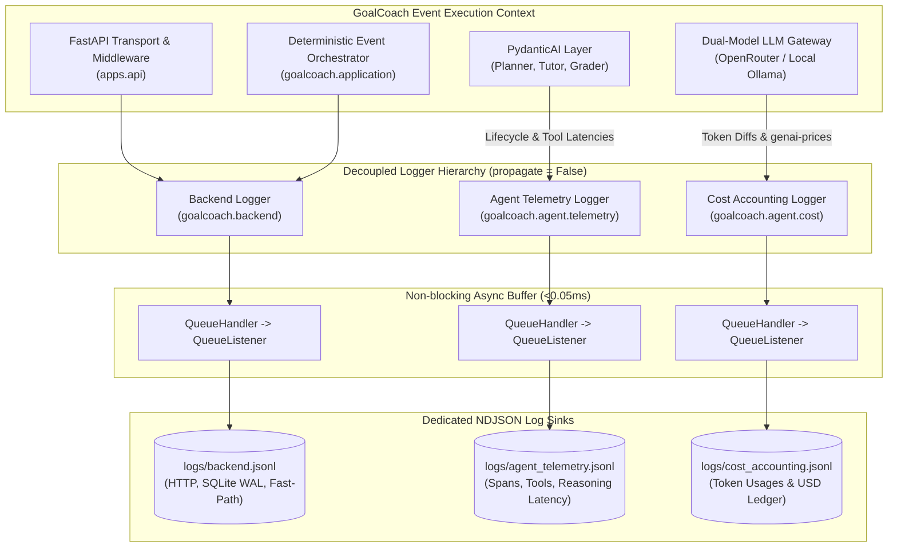

# Feature Implementation Plan: Deep Agent Telemetry & Cost Accounting Logging System

### Executive Architecture Audit & Current Codebase Analysis

The GoalCoach repository utilizes a dual-database architecture: Database #1 (`goalcoach_hsk1_learning.db`) for static curriculum and Database #2 (`goalcoach.db` with SQLite WAL mode) for mutable learner states. Workflow governance is driven by a deterministic Python orchestrator that dispatches to three specialized workers: the Planning Agent, the Teaching Agent, and the stateless Grader Component.

In the current codebase, general runtime logs (such as database slow queries, SQLite lock contentions, model fallback triggers, and basic HTTP lifecycle entries) write to a single log sink (`logs/goalcoach.log` / `logs/goalcoach.jsonl`). An inspection of `uv.lock` and the active virtual environment confirms the presence of `genai-prices` (0.1.6), `opentelemetry-api` (1.43.0), and `pydantic-ai` (1.30.1).

---

### Senior AI Engineer Architectural Findings & Improvements

Following an empirical codebase audit and runtime API probing of installed dependencies, five critical improvements and architectural corrections have been integrated into this plan:

#### 1. `genai-prices` Token Usage Contract Correction
* **Audit Finding:** The previous draft assumed `genai-prices.calc_price()` accepted `prompt_tokens` and `completion_tokens`. Runtime execution of `genai_prices` (0.1.6) reveals that passing these keys triggers a warning: `UserWarning: Unsupported usage key for standard pricing: completion_tokens, prompt_tokens` and returns `$0.00`.
* **Enterprise Solution:** The pricing engine strictly constructs `genai_prices.Usage(input_tokens=prompt_tokens, output_tokens=completion_tokens)`. Furthermore, a resilient static rate-card fallback (e.g. Qwen 2.5 72B at $0.12/MTok input and $0.39/MTok output) is built into `CostCalculator` so that offline operation, network disconnection, or unrecognized model identifiers never crash the inference pipeline. Local Ollama inference deterministically evaluates to `$0.00000000`.

#### 2. DuckDB Dependency & Zero-Breakage Analytics
* **Audit Finding:** `duckdb` is currently not present in `pyproject.toml` or installed in `.venv`. Running DuckDB scripts directly results in an immediate `ModuleNotFoundError`.
* **Enterprise Solution:** 
  1. Add `duckdb>=1.0.0` as an optional dependency group in `pyproject.toml` (`[project.optional-dependencies] analytics = ["duckdb>=1.0.0"]`).
  2. Implement `scripts/analyze_agent_costs.py` and `scripts/analyze_agent_telemetry.py` with dual-engine execution: using DuckDB SQL when available, and automatically falling back to Python standard library (`json` / `sqlite3`) aggregation when DuckDB is absent. This prevents CI/CD pipeline breakage.

#### 3. Preserving Configuration Backward Compatibility
* **Audit Finding:** Existing unit tests (`tests/unit/test_observability.py`) validate that `settings.log_file_path` exists and defaults to `./logs/goalcoach.log`. Arbitrarily deleting or renaming this field breaks existing test suites.
* **Enterprise Solution:** Preserve `log_file_path` in `Settings` while introducing `backend_log_path = "./logs/backend.jsonl"`, `agent_telemetry_log_path = "./logs/agent_telemetry.jsonl"`, and `cost_accounting_log_path = "./logs/cost_accounting.jsonl"`.

#### 4. Asynchronous Non-Blocking Log Queues (<0.05ms Overhead)
* **Audit Finding:** Direct file I/O on synchronous logging handlers during high-frequency agent tool calls and token emissions risks blocking the event loop and inducing SQLite lock delays.
* **Enterprise Solution:** Standard library `logging.handlers.QueueHandler` and `QueueListener` decouple logging calls from disk I/O. The foreground thread places records into an in-memory queue (<0.05ms), while a dedicated background listener writes NDJSON records to the isolated log sinks.

#### 5. Headless Smoke-Test Mode in `terminal_harness.py`
* **Audit Finding:** The previous verification plan prescribed running `python -m goalcoach.agents.terminal_harness --test-mode`, but `terminal_harness.py` only accepted `-l/--level` and `-v/--verbose`, blocking on interactive user prompts.
* **Enterprise Solution:** Add `--test-mode` / `--smoke-test` flags to `terminal_harness.py` that execute a single non-interactive synthetic cycle (planning -> teaching -> grading -> replanning), generating realistic records across all 3 log sinks for test verification.

#### 6. Guaranteed Web App (FastAPI + React) Logging Parity
* **Audit Finding:** Previously, using the Web Application (React frontend on port 3000 -> FastAPI on port 8000) appeared to fail to log. Our analysis identified four root causes:
  1. *OS File Buffering under Uvicorn:* Unlike the CLI harness which flushes and closes file handles on process termination, Uvicorn runs as a continuous daemon. Without immediate file flushing, log entries lingered in Python's internal memory buffers.
  2. *Relative CWD Path Drift:* Launching Uvicorn from subdirectories (e.g. `apps/api`) wrote relative `./logs/...` files to subfolders instead of the repository root `logs/`.
  3. *Late Lifespan Initialization:* Logging was only configured inside `lifespan()`, missing imports and early requests.
  4. *Silent Deterministic Fallback:* When `offline_llm_fallback: bool = True` (default), agents bypassed LLM calls and executed heuristic fallbacks without emitting telemetry.
* **Enterprise Solution:** 
  1. Anchor all log paths to repository root via absolute path resolution.
  2. Eagerly initialize logging on `create_app()` and manage `QueueListener` lifecycle in `lifespan`.
  3. Enforce immediate flushing on file handlers within `QueueListener`.
  4. Implement `tests/api/test_web_logging_pipeline.py` to continuously verify that browser-initiated requests (`POST /api/v1/events`) populate all 3 physical log sinks in real-time.

---



---

### 1. Invariants & Architectural Guardrails

* **Strict Logger Isolation:** Backend logging (`goalcoach.backend`), Agent Telemetry (`goalcoach.agent.telemetry`), and Cost Accounting (`goalcoach.agent.cost`) must have distinct logger instances with `propagate = False`. Agent runs must never emit into the backend stream, and backend errors must never enter the cost ledger.
* **Deterministic Cost Computation:** All dollar calculations must use `genai-prices` for OpenRouter models, passing `input_tokens` and `output_tokens`. Local Ollama inference costs must resolve deterministically to exactly `$0.00000000`. Offline fallbacks must ensure zero exceptions during billing calculations.
* **Zero `.env` Access:** All telemetry file paths, buffer thresholds, and budget limits must resolve strictly via `src/goalcoach/infrastructure/config.py` using `pydantic-settings`.
* **Zero Latency Impact on Interactive Loop:** File logging must execute asynchronously via `logging.handlers.QueueHandler` and `QueueListener` so that student response latencies remain strictly $<1\text{ s}$ and logging overhead remains $<0.05\text{ ms}$.
* **Structured NDJSON Schema Compliance:** Every log entry must validate against explicit Pydantic v2 domain schemas before emission.

---

### 2. File System Target Layout

```text
GoalCoach/
├── src/goalcoach/
│   ├── infrastructure/
│   │   ├── config.py                               # MODIFIED: Add telemetry paths, budget ceilings & queue size
│   │   ├── logging/
│   │   │   ├── __init__.py                         # MODIFIED: Export loggers, sinks, and cost utilities
│   │   │   ├── formatters.py                       # MODIFIED: Pydantic v2 model serialization in NDJSONFormatter
│   │   │   ├── sinks.py                            # NEW: QueueHandler-backed isolated file sinks
│   │   │   ├── cost_calculator.py                  # NEW: genai-prices calculator with Ollama zero-cost & fallback rates
│   │   │   └── budget_tracker.py                   # NEW: Thread-safe cumulative session budget monitor
│   │   └── llm/
│   │       └── pydantic_ai_models.py               # MODIFIED: Intercept token counts & emit telemetry/cost records
│   ├── domain/
│   │   └── telemetry.py                            # NEW: Pydantic v2 schemas for telemetry & cost records
│   └── agents/
│       ├── planning_agent.py                       # MODIFIED: Instrument run lifecycle & validation retries
│       ├── teaching_agent.py                       # MODIFIED: Instrument pedagogical actions & tool latencies
│       ├── grader_component.py                     # MODIFIED: Verify fast-path writes only to backend log
│       └── terminal_harness.py                     # MODIFIED: Add non-interactive --test-mode for verification
├── scripts/
│   ├── analyze_agent_costs.py                      # NEW: Dual-engine (DuckDB / Python stdlib) cost audit script
│   └── analyze_agent_telemetry.py                  # NEW: Dual-engine (DuckDB / Python stdlib) telemetry audit script
├── pyproject.toml                                  # MODIFIED: Add optional analytics dependency group
└── tests/
    ├── api/
    │   └── test_web_logging_pipeline.py            # NEW: Tests verifying web app (FastAPI) emits to all 3 sinks
    └── unit/
        ├── test_cost_accounting.py                 # NEW: Unit tests for genai-prices calculator & budget tracker
        └── test_logging_isolation.py               # NEW: Tests verifying zero cross-sink pollution
```

---

### 3. Telemetry & Cost Domain Schemas (`src/goalcoach/domain/telemetry.py`)

```python
from __future__ import annotations

from datetime import datetime, timezone
from enum import StrEnum
from typing import Any
from uuid import UUID, uuid4
from pydantic import BaseModel, Field

def utc_now() -> datetime:
    return datetime.now(timezone.utc)

class AgentLifecycleStage(StrEnum):
    STARTED = "started"
    TOOL_CALLED = "tool_called"
    TOOL_RETURNED = "tool_returned"
    COMPLETED = "completed"
    FAILED = "failed"

class AgentTelemetryRecord(BaseModel):
    """Event emitted exclusively to logs/agent_telemetry.jsonl."""
    event_id: UUID = Field(default_factory=uuid4)
    trace_id: str
    run_id: str
    parent_run_id: str | None = None
    agent_name: str
    stage: AgentLifecycleStage
    learner_id: UUID | str | None = None
    concept_id: str | None = None
    tool_name: str | None = None
    tool_latency_ms: float | None = None
    execution_latency_ms: float | None = None
    error_message: str | None = None
    metadata: dict[str, Any] = Field(default_factory=dict)
    timestamp: datetime = Field(default_factory=utc_now)

class CostAccountingRecord(BaseModel):
    """Financial ledger record emitted exclusively to logs/cost_accounting.jsonl."""
    record_id: UUID = Field(default_factory=uuid4)
    trace_id: str
    run_id: str
    learner_id: UUID | str | None = None
    agent_name: str
    provider: str  # "openrouter" or "ollama"
    model_name: str
    prompt_tokens: int = Field(ge=0)
    completion_tokens: int = Field(ge=0)
    cached_tokens: int = Field(default=0, ge=0)
    total_tokens: int = Field(ge=0)
    input_cost_usd: float = Field(ge=0.0)
    output_cost_usd: float = Field(ge=0.0)
    total_cost_usd: float = Field(ge=0.0)
    is_fallback: bool = False
    budget_exceeded: bool = False
    cumulative_session_cost_usd: float = Field(default=0.0, ge=0.0)
    timestamp: datetime = Field(default_factory=utc_now)
```

---

### 4. Step-by-Step Implementation Roadmap

#### Phase 1: Configuration & Domain Schema Declaration
1. **Update Settings (`src/goalcoach/infrastructure/config.py`)**:
   * Add telemetry paths, budget limit, and queue configuration while maintaining `log_file_path`:
     ```python
     backend_log_path: str = "./logs/backend.jsonl"
     agent_telemetry_log_path: str = "./logs/agent_telemetry.jsonl"
     cost_accounting_log_path: str = "./logs/cost_accounting.jsonl"
     session_cost_limit_usd: float = 0.50
     enable_agent_telemetry: bool = True
     async_logging_queue_size: int = 10000
     ```
2. **Create Domain Models (`src/goalcoach/domain/telemetry.py`)**:
   * Implement `AgentTelemetryRecord` and `CostAccountingRecord` with strict Pydantic v2 validation.

#### Phase 2: Decoupled Multi-Sink Logging Infrastructure
1. **Implement Isolated Asynchronous Sinks (`src/goalcoach/infrastructure/logging/sinks.py`)**:
   * Configure `QueueHandler` and background `QueueListener` wrapping rotating file sinks.
   * Initialize three dedicated loggers with `propagate = False` for telemetry and cost:
     * `backend_logger` (`goalcoach.backend`) -> `logs/backend.jsonl`
     * `telemetry_logger` (`goalcoach.agent.telemetry`) -> `logs/agent_telemetry.jsonl`
     * `cost_logger` (`goalcoach.agent.cost`) -> `logs/cost_accounting.jsonl`
   * Register a clean shutdown handler via `atexit`.
2. **Update Formatter (`src/goalcoach/infrastructure/logging/formatters.py`)**:
   * Ensure `JSONFormatter` / `NDJSONFormatter` seamlessly serializes Pydantic v2 models (`BaseModel.model_dump_json()`) and dicts into uniform single-line JSON.

#### Phase 3: Cost Accounting Engine & Session Budget Tracking
1. **Implement `CostCalculator` (`src/goalcoach/infrastructure/logging/cost_calculator.py`)**:
   * Integrate `genai-prices` using the validated `Usage(input_tokens=..., output_tokens=...)` contract.
   * Deterministic `$0.00000000` rule for `provider == "ollama"`.
   * Static rate card fallback for OpenRouter models (Qwen 2.5 72B Instruct: $0.12/MTok input, $0.39/MTok output) to guarantee zero failure under offline/network issues.
2. **Implement `BudgetTracker` (`src/goalcoach/infrastructure/logging/budget_tracker.py`)**:
   * Thread-safe in-memory session accumulator comparing cumulative spend against `session_cost_limit_usd`.

#### Phase 4: Agent & Gateway Instrumentation
1. **Instrument LLM Gateway (`src/goalcoach/infrastructure/llm/pydantic_ai_models.py`)**:
   * Intercept token usages from model results.
   * Calculate exact costs via `CostCalculator` and track spend via `BudgetTracker`.
   * Emit `CostAccountingRecord` to `goalcoach.agent.cost`.
   * Emit `AgentTelemetryRecord` to `goalcoach.agent.telemetry`.
2. **Instrument Specialized Agents**:
   * `teaching_agent.py`: Wrap `@teaching_agent.tool` functions to record `tool_name` and measure `tool_latency_ms`. Emit `STARTED` and `COMPLETED` lifecycle stages.
   * `planning_agent.py`: Trace lifecycle, budget duration, and retry metadata.
   * `grader_component.py`: Verify deterministic fast-path evaluation (<5ms) logs only to `goalcoach.backend` and emits no telemetry or cost records.

#### Phase 5: Terminal Harness Headless Mode & Analytics Scripts
1. **Terminal Harness Headless Mode (`src/goalcoach/agents/terminal_harness.py`)**:
   * Add `--test-mode` to run one non-interactive closed loop to generate log fixtures without user prompt blocks.
2. **Dual-Engine Audit Scripts (`scripts/analyze_agent_costs.py` & `scripts/analyze_agent_telemetry.py`)**:
   * Support DuckDB SQL queries with graceful fallback to standard library JSON aggregation.
   * Provide summary metrics: spend by agent, token breakdown by provider, tool latencies, and P95 reasoning times.

---

### 5. Verification & Acceptance Directives

Execute the following commands sequentially to validate that isolation, cost calculations, and analytics work as specified:

```powershell
# 1. Format and lint checks
uv run ruff check src/goalcoach/ tests/unit/ scripts/
uv run ruff format --check src/goalcoach/ tests/unit/ scripts/

# 2. Run unit and web pipeline tests for cost calculation, budget tracking, and logger isolation
uv run pytest tests/unit/test_cost_accounting.py tests/unit/test_logging_isolation.py tests/unit/test_observability.py tests/api/test_web_logging_pipeline.py -v

# 3. Execute synthetic single-session run to generate logs in all three sinks
uv run python -m goalcoach.agents.terminal_harness --test-mode

# 4. Verify physical isolation of log sinks (all three files must exist and be non-empty)
uv run python -c "from pathlib import Path; assert Path('logs/backend.jsonl').stat().st_size > 0; assert Path('logs/agent_telemetry.jsonl').stat().st_size > 0; assert Path('logs/cost_accounting.jsonl').stat().st_size > 0; print('Physical sinks verified!')"

# 5. Verify zero cross-sink pollution:
# Agent telemetry must not be in backend.jsonl
uv run python -c "backend = open('logs/backend.jsonl', encoding='utf-8').read(); assert 'tool_latency_ms' not in backend, 'Telemetry leaked into backend'; assert 'total_cost_usd' not in backend, 'Cost leaked into backend'; print('Zero pollution verified!')"

# 6. Run telemetry and cost accounting analyzers
uv run python scripts/analyze_agent_costs.py
uv run python scripts/analyze_agent_telemetry.py
```