# Architectural Audit & Deep-Dive: Closed-Loop Agentic System Fixes & Remedial Loop Analysis

**Author:** Principal Senior Software Engineer (Systems & AI Architecture)  
**Date:** September 16, 2026  
**Audience:** GoalCoach Engineering & AI Agent Teams  
**Target File Location:** `docs/dev/CLOSED_LOOP_AUDIT_BEFORE_AFTER_COMPARISON.md`  
**Reference Commits:**
- **Baseline State (Before Fix):** [`616690a` .. `b01a56f`](file:///Users/MusabKaya/Documents/GoalCoach/docs/dev) (Initial closed-loop agentic & test implementation up to `7f3248e` / `75a895f`)
- **Remediated State (After Fix):** [`3869f58`](file:///Users/MusabKaya/Documents/GoalCoach/docs/dev) (`fix(agents): harden LLM fallback and ground terminal grading`)

---

## Executive Summary

During closed-loop testing of the GoalCoach agentic learning system, manual and end-to-end evaluations uncovered two critical architectural and data-integrity defects, alongside several algorithmic and pedagogical boundary conditions.

1. **The "Tautological Grader" Integrity Bug**: The terminal harness emitted a fabricated exercise ID (`{concept_id}_practice`). When not found in curriculum Database #1, the orchestrator synthesized an in-memory `Exercise` with `reference_answers = [user_answer]`. Consequently, **any submitted answer was judged against itself**, guaranteeing a 100% false pass rate, 1.0 rubric scores, and complete bypass of LLM evaluation via the deterministic fast path.
2. **The "Phantom Ollama" Failover Cascade**: When OpenRouter produced a structured-output schema validation error or experienced a transient network glitch, `run_with_fallback()` indiscriminately trapped generic `Exception` and routed the request to `http://localhost:11434/v1` (Ollama). Since Ollama was not installed in the environment, the connection was refused, forcing every agent worker to prematurely collapse into its deterministic heuristic fallback.
3. **The Unresolved Remediation Loop (Problem 6)**: When a learner fails 3 times, they enter a remediation loop where the system presents the exact same question three times in a row, passes them deterministically, and struggles to exit. This is caused by an uncoupled mathematical stepping gap ($0.0 \to 0.25 \to 0.50 \to 0.75$), static database exercise fetching (`limit=1, randomize=False`), and uncleared error records in `state.error_profile`.

Commit [`3869f58`](file:///Users/MusabKaya/Documents/GoalCoach/docs/dev) resolved defects #1 and #2. This audit explains what changed, how the system failed previously, and how to structurally eliminate the remaining remediation and curriculum sequencing defects.

---

## High-Level Architecture: Before vs. After

```mermaid
flowchart TD
    subgraph BeforeFix ["Before Fix: Commits 616690a to b01a56f"]
        A1["Terminal Harness"] -->|"Sends fake ID: hsk1_c01_practice"| B1["Deterministic Orchestrator"]
        B1 -->|"Lookup fails in DB #1"| C1["Synthetic Exercise Creation<br/>reference_answers = user_answer"]
        C1 -->|"Passes to GraderComponent"| D1["Exact Match Fast-Path<br/>answer == ref_answer"]
        D1 -->|"Result: passed=True, scores=1.0"| E1["Learner Always Passes!"]
        
        F1["OpenRouter LLM"] -->|"Schema validation failure"| G1["run_with_fallback: catch Exception"]
        G1 -->|"Blind failover"| H1["Ollama at localhost:11434<br/>Connection Refused!"]
        H1 -->|"Exception bubbled"| I1["Silent Fallback to Heuristic Rules"]
    end

    subgraph AfterFix ["After Fix: Commit 3869f58"]
        A2["TeachingWorker"] -->|"Grounds action via DB #1"| B2["attach_curriculum_exercise<br/>Real ID: hsk1_c01_e01"]
        B2 -->|"Sends action + payload"| C2["Terminal Harness: Displays and Submits Real ID"]
        C2 -->|"Sends hsk1_c01_e01"| D2["Deterministic Orchestrator"]
        D2 -->|"Strict DB #1 Validation"| E2{"Known Exercise?"}
        E2 -->|"No"| F2["Raises ValueError (Safety Gate)"]
        E2 -->|"Yes"| G2["GraderComponent Evaluation"]
        G2 -->|"Exact match to real DB answer"| H2["Deterministic Fast-Path"]
        G2 -->|"Semantic answer"| I2["OpenRouter LLM Rubric Evaluation"]

        J2["OpenRouter LLM"] -->|"Schema retry"| K2["PydanticAI output_retries=2"]
        K2 -->|"Persistent failure"| L2{"enable_ollama_fallback == true?"}
        L2 -->|"No (Default)"| M2["Immediate re-raise to caller (No Ollama hang)"]
        L2 -->|"Yes"| N2["Try Ollama if explicitly configured"]
    end
```



---

## Detailed File-by-File State Comparison

| File | Before (`b01a56f` / `7f3248e`) | After (`3869f58`) | Architectural Impact |
| :--- | :--- | :--- | :--- |
| [`src/goalcoach/infrastructure/config.py`](file:///Users/MusabKaya/Documents/GoalCoach/src/goalcoach/infrastructure/config.py) | No flag to disable Ollama. Fallback was hardcoded as the default next hop. | Added `enable_ollama_fallback: bool = False`. | Prevents uninstalled services from being invoked in production and standard dev environments. |
| [`.env.example`](file:///Users/MusabKaya/Documents/GoalCoach/.env.example) | Missing environment variable for Ollama failover. | Added `GOALCOACH_ENABLE_OLLAMA_FALLBACK=false`. | Explicit configuration contract for deployment. |
| [`src/goalcoach/infrastructure/llm/pydantic_ai_models.py`](file:///Users/MusabKaya/Documents/GoalCoach/src/goalcoach/infrastructure/llm/pydantic_ai_models.py) | 1. Trapped `(httpx.HTTPError, httpx.TimeoutException, Exception)` indiscriminately.<br>2. Always connected to `localhost:11434`.<br>3. Did not expose structured-output retry count.<br>4. Ignored configured timeout on HTTP clients. | 1. Configured `httpx.AsyncClient(timeout=settings.llm_timeout_seconds)`.<br>2. Categorized errors into `output validation` (`UnexpectedModelBehavior`) and `connection/provider` (`HTTPError`, `ModelAPIError`).<br>3. Checks `settings.enable_ollama_fallback`; if False, immediately re-raises.<br>4. Added `get_output_retries() -> int`. | Eliminates phantom hangs against localhost; passes LLM schema validation retries to the underlying driver. |
| [`src/goalcoach/agents/planning_agent.py`](file:///Users/MusabKaya/Documents/GoalCoach/src/goalcoach/agents/planning_agent.py) | PydanticAI agent had default (1) retry count on structured validation failure. | Added `output_retries=get_output_retries()`. | Gives OpenRouter LLM configured chances (e.g. 2) to correct JSON schema violations for `PlanUpdate`. |
| [`src/goalcoach/agents/teaching_agent.py`](file:///Users/MusabKaya/Documents/GoalCoach/src/goalcoach/agents/teaching_agent.py) | 1. Returned generated or heuristic `TeachingAction` without curriculum exercise grounding.<br>2. Default retry count. | 1. Added `output_retries=get_output_retries()`.<br>2. Added `_attach_curriculum_exercise()` to both LLM path and heuristic fallback.<br>3. Populates `action.exercise_payload` with canonical `exercise_id`, `prompt`, and `instruction` from Database #1. | Ensures every teaching moment is strictly anchored to a real, database-backed assessment item. |
| [`src/goalcoach/agents/grader_component.py`](file:///Users/MusabKaya/Documents/GoalCoach/src/goalcoach/agents/grader_component.py) | 1. Default retry count.<br>2. Critical error guardrail matched exact strings in a small set (`ERR_QUESTION_MA`, etc.). | 1. Added `output_retries=get_output_retries()`.<br>2. Hardened critical error checking using case-insensitive prefix scanning (`critical_prefixes = ("ERR_QUESTION_MA", "ERR_WORD_ORDER", "ERR_MODAL_HUI", "ERR_SEMANTIC", "ERR_VOCABULARY", "ERR_PRAGMATIC", "ERR_GRAMMAR")`). | Prevents LLMs from accidentally passing a student when critical syntactic or vocabulary failures are flagged. |
| [`src/goalcoach/agents/terminal_harness.py`](file:///Users/MusabKaya/Documents/GoalCoach/src/goalcoach/agents/terminal_harness.py) | 1. Displayed raw modal content only.<br>2. Hardcoded submission of `exercise_id = f"{concept_id}_practice"`. | 1. Renders a dedicated `Practice` panel with the curriculum prompt and instruction.<br>2. Submits `str(exercise_payload["exercise_id"])`.<br>3. Raises `RuntimeError` if an action has no exercise payload. | Connects CLI user experience directly to the curriculum data layer. |
| [`src/goalcoach/application/orchestrator.py`](file:///Users/MusabKaya/Documents/GoalCoach/src/goalcoach/application/orchestrator.py) | In `_handle_answer_submitted`: when `content_service.get_exercise(exercise_id)` was None, created a synthetic `Exercise` with `reference_answers = [answer]`. | Removed synthetic fallback entirely. Now raises `ValueError(f"Unknown exercise_id {exercise_id!r}...")`. | Closes the security and data-integrity loophole where arbitrary strings could be graded as 100% correct. |
| [`tests/integration/test_closed_loop.py`](file:///Users/MusabKaya/Documents/GoalCoach/tests/integration/test_closed_loop.py) | Tested strategy switching without asserting exercise payload. | 1. Asserts `action.exercise_payload["exercise_id"] == "hsk1_c04_e01"`.<br>2. Added regression test `test_unknown_exercise_is_rejected_instead_of_treating_answer_as_reference`. | Prevents regressions in exercise grounding and synthetic answer exploitation. |

---

## Root Cause Analysis: The Two Main Fixed Problems

### Problem 1: LLM Orchestration & Phantom Ollama Fallback

#### The Defect
In commit [`c0385df`](file:///Users/MusabKaya/Documents/GoalCoach/docs/dev), model failover was introduced to protect against OpenRouter downtime:
```python
# Before fix in pydantic_ai_models.py
try:
    result = await agent.run(prompt, deps=deps, model=primary_model)
    return result, f"openrouter:{primary_model.model_name}"
except (httpx.HTTPError, httpx.TimeoutException, Exception) as err:
    logger.warning("Primary model failed (%s). Falling back to local Ollama Gemma 4.", err)
    fallback_model = get_ollama_fallback_model()
    result = await agent.run(prompt, deps=deps, model=fallback_model)
    return result, f"ollama:{fallback_model.model_name}"
```

#### Why it Broke
1. **Schema Validation vs. Transport Failures**: PydanticAI validates LLM JSON output against Pydantic models (`TeachingAction`, `PlanUpdate`, `GradingResult`). If the LLM produces Markdown formatting, an extra key, or omits a required field, PydanticAI raises `UnexpectedModelBehavior`.
2. **Indiscriminate Exception Trapping**: Catching `Exception` caused validation errors to be treated as transport outages.
3. **Hardcoded Secondary Hop**: The code immediately dialed `http://localhost:11434/v1`. Because Ollama was not running, the OS rejected the socket connection (`ConnectError: Connection refused`).
4. **Agent-Level Collapse**: The exception was trapped in `teaching_agent.py` or `planning_agent.py` by `except Exception as exc:`, causing the agent to silently drop to `_heuristic_fallback()`. The user observed that the system constantly showed heuristic responses instead of AI-generated teaching.

#### The Fix in Commit 3869f58
1. **Separation of Concerns**: Differentiated `UnexpectedModelBehavior` (schema validation) from `httpx.HTTPError` / `ModelAPIError` (network/provider failure).
2. **Opt-in Fallback**: Introduced `Settings.enable_ollama_fallback = False`. Ollama is never contacted unless explicitly enabled.
3. **Structured Output Retries**: Passed `output_retries=get_output_retries()` (`GOALCOACH_LLM_MAX_RETRIES=2`) to PydanticAI's `Agent` constructor. When OpenRouter outputs invalid JSON, PydanticAI automatically sends a reflection message back to OpenRouter: *"The output did not conform to the schema: [errors]. Please correct it."* This resolved >95% of format deviations before any fallback was triggered.

---

### Problem 2: Grading Integrity Bug & The Tautological Answer

#### The Defect
In [`src/goalcoach/agents/terminal_harness.py`](file:///Users/MusabKaya/Documents/GoalCoach/src/goalcoach/agents/terminal_harness.py), the learning loop dispatched:
```python
# Before fix in terminal_harness.py
await orchestrator.handle_event(
    event_type=EventType.ANSWER_SUBMITTED,
    learner_id=learner_id,
    payload={
        "exercise_id": f"{concept_id}_practice",
        "concept_id": concept_id,
        "answer": user_input,
    },
)
```
In [`src/goalcoach/application/orchestrator.py`](file:///Users/MusabKaya/Documents/GoalCoach/src/goalcoach/application/orchestrator.py):
```python
# Before fix in orchestrator.py
content_ex = self.content_service.get_exercise(exercise_id)
if content_ex:
    ...
else:
    exercise = Exercise(
        id=exercise_id,
        concept_id=concept_id,
        prompt="Practice sentence",
        target_instruction="Translate or construct",
        reference_answers=[answer],  # <--- CRITICAL DATA INTEGRITY BUG
        hsk_level=1,
    )
```

#### Why it Broke
Curriculum exercises in Database #1 use primary keys like `hsk1_c01_e01`. An ID like `hsk1_c01_practice` never existed in the database.
When the orchestrator encountered this missing ID, instead of failing fast, it dynamically constructed an `Exercise` object whose standard `reference_answers` was populated with the **user's own input** (`[answer]`).

When passed to `GraderComponent.grade`:
```python
exact_match = any(
    self._normalize(answer) == self._normalize(ref)
    for ref in exercise.reference_answers
)
if exact_match:
    return GradingResult(
        passed_gates=True,
        scores=RubricScores(grammatical_correctness=1.0, semantic_precision=1.0, pragmatic_appropriateness=1.0),
        grader_version="deterministic-fast-path",
        ...
    )
```
Since `answer == answer` is a tautology, every answer—whether `"你好"`, `"xyz"`, or `"12345"`—matched the reference answer identically. The deterministic fast path immediately awarded a perfect score ($1.0$), marked the gates as passed, and updated learner mastery. OpenRouter was never invoked, and incorrect answers were never detected.

#### The Fix in Commit 3869f58
1. **Teaching Action Grounding**: In `TeachingWorker`, `_attach_curriculum_exercise()` fetches the real canonical exercise from Database #1 and attaches its ID, prompt, and instruction to `TeachingAction.exercise_payload`.
2. **Terminal Discipline**: `terminal_harness.py` reads `action.exercise_payload["exercise_id"]` and displays the real question. When the user responds, it submits the canonical database ID (e.g. `hsk1_c01_e01`).
3. **Fail-Closed Validation**: The orchestrator completely eliminated synthetic fallback exercises. If an unknown `exercise_id` is submitted, it raises `ValueError`.

---

## Deep-Dive: Problem 6 — The Unresolved "Remediation Loop" Bug

Your teammate reported:
> *"After wrong for 3 times, I entered remediation. And it repeats three times the same simple question, and grade me with deterministic pass. Seems will never stop…"*

While commit [`3869f58`](file:///Users/MusabKaya/Documents/GoalCoach/docs/dev) fixed the model failover and the fake exercise ID bug, **it did not resolve the remedial loop logic**.

### The Underlying Mechanics (Step-by-Step Code Walkthrough)

#### 1. Why Did the Learner Enter Remediation After 3 Wrong Answers?
In [`src/goalcoach/application/progress_service.py`](file:///Users/MusabKaya/Documents/GoalCoach/src/goalcoach/application/progress_service.py#L90-L113):
```python
# Lines 91-95: Every failed answer records an error code in error_profile
error_codes = result.detected_errors if result.detected_errors else [f"ERR_UNSPECIFIED_{concept_id}"]
for code in error_codes:
    self._record_error(state, code=code, concept_id=concept_id, at=now)

# Lines 103-112: The replanning gate
for err in state.error_profile:
    if err.concept_id == concept_id and err.occurrences >= 2:
        state.needs_replanning = True
        break
```
When the user answered incorrectly 3 times, `occurrences` reached 3. This triggered `state.needs_replanning = True`.

#### 2. Why Did It Repeat Exactly 3 Times?
In [`src/goalcoach/agents/planning_agent.py`](file:///Users/MusabKaya/Documents/GoalCoach/src/goalcoach/agents/planning_agent.py#L172-L182):
```python
# 1. Remedial: Check errors or weak mastery (< 0.60)
remedial_candidates: list[str] = []
if state.needs_replanning and state.error_profile:
    sorted_errors = sorted(state.error_profile, key=lambda e: e.occurrences, reverse=True)
    remedial_candidates.extend(e.concept_id for e in sorted_errors)

for cid, m in state.mastery.items():
    if m.mastery_score < 0.60 and cid not in remedial_candidates:
        remedial_candidates.append(cid)
```
Now examine how mastery increases in [`src/goalcoach/application/progress_service.py`](file:///Users/MusabKaya/Documents/GoalCoach/src/goalcoach/application/progress_service.py#L75-L77):
```python
if result.passed_gates:
    mastery.mastery_score = max(0.0, min(1.0, round(mastery.mastery_score + 0.25, 4)))
```
Let's trace the arithmetic after 3 consecutive failures:
- Initial state after 3 failures: `mastery_score = 0.0`. Threshold to exit remediation: `0.60`.
- **Pass 1:** $0.0 + 0.25 = \mathbf{0.25}$ (Still $< 0.60 \implies$ Planner schedules remediation).
- **Pass 2:** $0.25 + 0.25 = \mathbf{0.50}$ (Still $< 0.60 \implies$ Planner schedules remediation).
- **Pass 3:** $0.50 + 0.25 = \mathbf{0.75}$ (Now $\ge 0.60 \implies$ Exits the $< 0.60$ check!).

Because $\lceil (0.60 - 0.0) / 0.25 \rceil = 3$, the learner is mathematically trapped for **exactly 3 turns**.

#### 3. Why Was It the Exact Same Question Every Time?
In [`src/goalcoach/agents/teaching_agent.py`](file:///Users/MusabKaya/Documents/GoalCoach/src/goalcoach/agents/teaching_agent.py#L170-L175):
```python
exercises = content_service.get_exercises_for_concept(
    action.concept_id,
    limit=1,
    randomize=False,
)
```
And in [`src/goalcoach/infrastructure/persistence/repositories.py`](file:///Users/MusabKaya/Documents/GoalCoach/src/goalcoach/infrastructure/persistence/repositories.py#L83-L93):
```python
order = func.random() if randomize else ContentExercise.exercise_order
statement = (
    select(ContentExercise)
    .join(ContentExercise.concept)
    .where(
        ContentExercise.concept_id == concept_id,
        CurriculumConcept.is_active.is_(True),
    )
    .order_by(order)
    .limit(limit)
)
```
Because `randomize=False` and `limit=1`, the query sorts by `exercise_order` ascending and takes the first row. It will **always select `hsk1_c01_e01`**. There was no exercise rotation, no exclusion of recently answered exercises, and no retrieval from the remedial exercise pool.

#### 4. Why Did It Seem Like It Will "Never Stop"? (The Ghost Error Leak)
Even when `mastery_score` finally reaches 0.75, look at `state.error_profile`.
In the current codebase:
- `_record_error()` appends or increments errors.
- **There is NO method in `progress_service.py` that removes, decays, or clears an error when remediation succeeds!**
- Even after passing, `state.error_profile` still contains `[ErrorRecord(code='ERR_VOCABULARY', concept_id='hsk1_c01', occurrences=3)]`.
- If `state.needs_replanning` is ever triggered again (or in fallback planning where `state.error_profile` is checked), `hsk1_c01` is perpetually flagged as the top remedial candidate.

---

## Review of Other Reported Issues (Items 2, 3, 4, 5)

### Item 2: Mastery Equation vs. Hardcoded 0.25
- **Current Behavior:** Linear stepping (`+0.25` on pass, `-0.10` on fail).
- **Architectural Assessment:** As noted in the codebase comments, this was an intentional Phase 3 MVP simplification. However, real spaced repetition (Half-life regression / Ebisu / SuperMemo SM-2) calculates recall probability based on elapsed time: $R = 2^{-\Delta t / h}$. Mastery should be derived from rubric performance rather than an arbitrary flat increment.
- **Recommendation:** Implement a Bayesian or logistic update formula:
  $$\Delta M = \eta \cdot (\text{rubric\_score} - M)$$
  where $\eta$ is learning rate adjusted by question difficulty.

### Item 3: Instructions Should Always Speak English
- **Current Behavior:** OpenRouter prompts occasionally generated explanations in Chinese or mixed Chinese/English, confusing beginners.
- **Root Cause:** In `TEACHING_SYSTEM_PROMPT` ([`teaching_agent.py`](file:///Users/MusabKaya/Documents/GoalCoach/src/goalcoach/agents/teaching_agent.py#L35-L60)), there was no explicit linguistic constraint.
- **Recommendation:** Add an explicit constraint to `TEACHING_SYSTEM_PROMPT`:
  ```text
  Linguistic Policy: Always explain concepts and provide guidance in English. Only target vocabulary, sample sentences, and pinyin should be in Chinese.
  ```

### Item 4: Prerequisite Enforcement (Should Not Reach c15 Without c01)
- **Reported Observation:** Prerequisite bypass observed during testing.
- **Code Inspection:** In [`src/goalcoach/agents/planning_agent.py`](file:///Users/MusabKaya/Documents/GoalCoach/src/goalcoach/agents/planning_agent.py#L218-L223):
  ```python
  prereqs = prereq_graph.get(cid, frozenset())
  prereqs_met = all(
      (p in state.mastery and state.mastery[p].mastery_score >= 0.50)
      for p in prereqs
  )
  ```
  The heuristic fallback *does* check prerequisites. However, the OpenRouter LLM planner prompt only said:
  `Schedule NEW concepts only if their prerequisites are satisfied.`
  The LLM was given the tool `get_concept_prerequisites`, but if the model hallucinated or skipped calling the tool, the post-validation guardrail:
  ```python
  all_valid_ids = {c.concept_id for c in content_service.list_all_concepts()}
  validated_items = [item for item in plan_update.ordered_items if item.concept_id in all_valid_ids]
  ```
  **only checked if the concept exists in the database**, not whether its prerequisites were met in `state.mastery`!
- **Recommendation:** Add a deterministic DAG validation filter to `PlanningWorker.create_plan` that purges any concept whose prerequisites are unsatisfied before returning the plan to the orchestrator.

### Item 5: Accept Pinyin Without Tone
- **Current Behavior:** The fast-path grader strictly compares stripped strings. If the student types `ni hao` instead of `nǐ hǎo` or `你好`, exact match fails.
- **Recommendation:** Add a pinyin normalization utility in `GraderComponent._normalize()` using standard unicode diacritic stripping (e.g. `unicodedata.normalize('NFKD', text)`), allowing tone-agnostic pinyin matching on vocabulary exercises.

---

## Action Plan to Fix the Remedial Problem

To eliminate the repeating question loop and properly resolve Problem 6, implement the following four changes:

### 1. Dynamic Exercise Rotation & Exclusion
In `TeachingWorker._attach_curriculum_exercise`:
```python
# Pass learner state and exclude recently completed or failed exercise IDs
attempted_ids = set(state.today_mistake_exercise_ids)
exercises = content_service.get_exercises_for_concept(
    action.concept_id,
    limit=5,
    randomize=True,
)
available = [e for e in exercises if e.exercise_id not in attempted_ids]
exercise = available[0] if available else exercises[0]
```

### 2. Leverage Dedicated Remedial Exercises
`ContentService` already provides `get_remedial_exercises(error_tag: str)`. When `action.action_kind == TeachingActionKind.HINT` or `state.needs_replanning`:
Query exercises tagged with the specific error (e.g., `ERR_VOCABULARY`) rather than re-serving the introductory concept exercise `_e01`.

### 3. Clear/Decay Error Profile Upon Demonstrated Mastery
In `ProgressService.apply_grading_result`:
When `result.passed_gates` is True:
```python
# If the learner passes, resolve/decrement recurring errors for this concept
state.error_profile = [
    err for err in state.error_profile
    if not (err.concept_id == concept_id and err.occurrences <= 1)
]
for err in state.error_profile:
    if err.concept_id == concept_id:
        err.occurrences -= 1
```

### 4. Propagate Real Failure History in Session Start
In `DeterministicOrchestrator._handle_session_started`:
Instead of hardcoding `failed_attempts=0`:
```python
failed_attempts = len([e for e in state.error_profile if e.concept_id == concept_id])
teaching_action = await self.teaching_worker.teach_concept(
    concept_id=concept_id,
    state=state,
    content_service=self.content_service,
    failed_attempts=failed_attempts,
)
```
This enables the Teaching Agent to naturally switch modality to `CONTRAST_EXAMPLE` or `HINT` instead of repeating `EXPLANATION`.

---

## Summary & Verification Checklist

- [x] **OpenRouter Retries:** Enabled via `output_retries=get_output_retries()` across all agents.
- [x] **Ollama Decoupling:** Made opt-in via `Settings.enable_ollama_fallback = False`.
- [x] **Exercise Grounding:** Canonical database exercises attached via `TeachingWorker._attach_curriculum_exercise()`.
- [x] **Terminal Grader Grounding:** Submits valid `exercise_id`, displays prompt in green panel.
- [x] **Fast-Path Integrity:** Orchestrator rejects unknown exercises (`ValueError`), eliminating the tautological reference answer vulnerability.
- [ ] **Remedial Rotation:** Needs implementation of exercise history filtering.
- [ ] **Error Decay:** Needs cleanup of `state.error_profile` upon consecutive passes.
- [ ] **Prerequisite Guardrail:** Needs deterministic DAG pruning in `PlanningWorker`.
