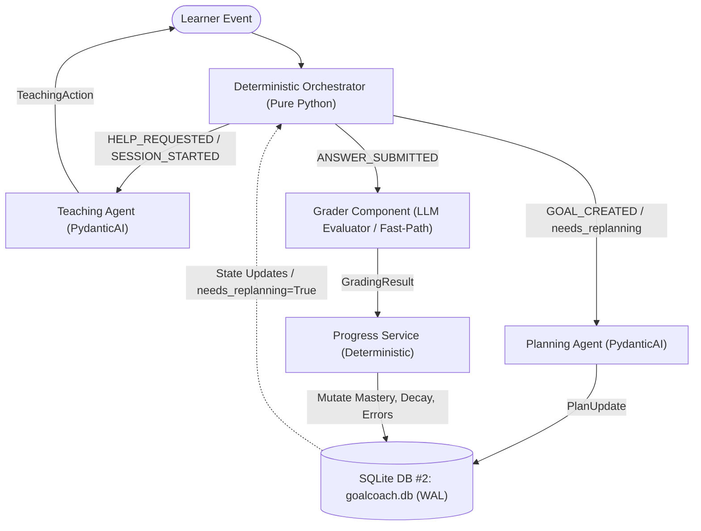

# GoalCoach — MVP Backend & Agentic System Implementation Plan

**Author:** Principal Senior AI Engineer  
**Target Specification:** [docs/GOALCOACH_MVP_PRD.md](file:///C:/Users/musab/Documents/GoalCoach/docs/GOALCOACH_MVP_PRD.md)  
**Development Phases Reference:** [docs/dev/GOALCOACH_MVP_DEV_PHASES.md](file:///C:/Users/musab/Documents/GoalCoach/docs/dev/GOALCOACH_MVP_DEV_PHASES.md)  
**Status:** Ready for Review & Execution  

---

## 1. Executive Summary & Architectural Invariants

GoalCoach is a closed, state-driven agentic learning system for HSK1 Chinese. It is not an unconstrained conversational chatterbot. Every learner interaction mutates a single authoritative persistent state (`LearnerState` in SQLite `goalcoach.db`), and that state deterministically dictates future curriculum planning and instructional interventions.

### 1.1 Non-Negotiable Invariants

1. **The Core Axiom:**  
   $$\text{Same Goal} + \text{Different Learner State} \implies \text{Different Plan}$$
2. **Pedagogical Invariant:**  
   $$\text{Same Concept} + \text{Different Error History} \implies \text{Different Instructional Action}$$
3. **Strict Separation of Concerns:**
   - **Deterministic Engines (Pure Python):** Event dispatching, state persistence, mastery mutations, retention decay calculations, prerequisite checks, and input/output validation.
   - **Reasoning Agents (PydanticAI):** Reserved *exclusively* for non-deterministic decisions:
     - **Planning Agent:** *What* to study next (daily queue allocation, remedial prioritization, roadmap adjustments).
     - **Teaching Agent:** *How* to teach right now (pedagogical mode selection: `EXPLANATION`, `HINT`, `CONTRAST_EXAMPLE`, `EXERCISE`, `DIALOGUE`, `RETRY`).
   - **Grader Component (Stateless LLM Evaluator):** Evaluates freeform answers against a strict 3-axis rubric with deterministic fast-path short-circuiting. It is **not** an autonomous agent and executes no agentic loops.
4. **Zero Sequential Multi-Agent Pipelines:** Single interaction events must never trigger sequential agent chains (e.g., Planner $\rightarrow$ Tutor $\rightarrow$ Grader $\rightarrow$ Progress in one turn is strictly prohibited).
5. **Zero Heavy Vector DB Overload:** Vector retrieval (ChromaDB) is completely bypassed for the HSK1 MVP. All concept and prerequisite lookups execute via the deterministic `ContentService` querying Database #1 (`data/database1/goalcoach_hsk1_learning.db`) in $<1\text{ ms}$.
6. **Persistent State as Single Source of Truth:** SQLite Database #2 (`goalcoach.db`) with WAL mode is the sole persistence store.
7. **Environment Safety:** Never access, read, or modify `.env` files.



---

## 2. Current Codebase Gap Analysis

A rigorous audit of the current repository against `docs/GOALCOACH_MVP_PRD.md` reveals the following architectural gaps:

| Component Area | Current State in Codebase | Target Requirement in PRD | Action Required |
|---|---|---|---|
| **Domain Enums** (`domain/enums.py`) | Has `PlanItemKind`, `PlanStatus`, `RetrievalMode`. | Missing `EventType` (`GOAL_CREATED`, `SESSION_STARTED`, `HELP_REQUESTED`, `ANSWER_SUBMITTED`) and `TeachingActionKind` (`EXPLANATION`, `HINT`, `CONTRAST_EXAMPLE`, `EXERCISE`, `DIALOGUE`, `RETRY`, `FREEFORM`). | **Modify** `domain/enums.py`. |
| **Domain Events** (`domain/events.py`) | Does not exist. | Explicit typed events with structured payloads for event-driven orchestration. | **Create** `domain/events.py`. |
| **Domain Models** (`domain/models.py`) | Has legacy `TurnResponse` in agent file; `LearnerState` lacks `needs_replanning` and `context_interests`. | Must define Pydantic v2 `TeachingAction` and `PlanUpdate`; update `LearnerState` with `needs_replanning: bool = False` and `context_interests: list[str]`. | **Modify** `domain/models.py`. |
| **Content Service** (`persistence/content_service.py`) | Missing dedicated service abstraction; calls raw `ContentRepository`. | High-level deterministic `ContentService` providing grounded queries (`get_concept`, `get_examples`, `get_prerequisites`, `list_all_concepts`). | **Create** `infrastructure/persistence/content_service.py`. |
| **Learner Persistence** (`persistence/learner_repository.py`) | Inlined in `repositories.py`. | Dedicated module interface with verified SQLite WAL pragmas (`journal_mode=WAL`, `busy_timeout=5000`, `synchronous=NORMAL`). | **Create / Re-export** `infrastructure/persistence/learner_repository.py`. |
| **Progress Service** (`application/progress_service.py`) | `progress_reducer.py` exists with legacy 40/40/20 logic, not matching the PRD mathematical spec (Section 11). | Dedicated deterministic `ProgressService` implementing mastery deltas ($+0.25$ on pass, $-0.10$ on fail), interval scaling ($1.8\times$), retention decay ($R(t) = R_0 e^{-\lambda \Delta t}$), mistake logging, and `needs_replanning` gate (occurrences $\ge 2$). | **Create** `application/progress_service.py`. |
| **Orchestrator** (`application/orchestrator.py`) | `src/goalcoach/ui/orchestrator.py` has simple `PlanningOrchestrator` & UI routing. | Pure deterministic event-routing orchestrator executing the priority lifecycle without chaining agents. | **Create** `application/orchestrator.py`. |
| **Planning Agent** (`agents/planning_agent.py`) | Deterministic rule-based planner exists in `goal_planning.py`. | PydanticAI reasoning agent with `deps_type=PlanningDeps`, tools over `ContentService`, and structured output `result_type=PlanUpdate`. | **Create** `agents/planning_agent.py`. |
| **Teaching Agent** (`agents/teaching_agent.py`) | Prototype terminal script emitting unaligned `TurnResponse`. | PydanticAI ZPD tutor agent outputting `TeachingAction`, selecting pedagogical modality based on error history and failed attempts. | **Refactor** `agents/teaching_agent.py`. |
| **Grader Component** (`agents/grader_component.py`) | `grading_agent.py` exists with basic structure. | Stateless evaluator with exact-match fast path bypass + PydanticAI 3-axis rubric evaluation and error taxonomy tagging (`ERR_QUESTION_MA`, `ERR_WORD_ORDER`, etc.). | **Create / Harmonize** `agents/grader_component.py`. |
| **API Wiring & Conftest** (`apps/api/`, `tests/conftest.py`) | `apps/api/routes/tutoring.py` has broken imports (`TutorResponse`, `chat_with_tutor`) which broke `conftest.py` test suite. | Create unified event route `POST /api/v1/events` in `apps/api/routes/learning_loop.py`; fix or replace broken tutoring route. | **Create** `learning_loop.py` & **Modify** `main.py`. |
| **Integration Proof** (`tests/integration/test_closed_loop.py`) | No end-to-end closed loop test proving AC1–AC11. | Full integration tests verifying state persistence, plan adaptation based on state, and teaching modality switching. | **Create** `tests/integration/test_closed_loop.py`. |

---

## 3. Detailed Phase-by-Phase Implementation Plan

### Phase 1: Domain Contracts & Schema Harmonization

#### Subtask 1.1: Define Event Enums and Action Kinds
- **File:** `src/goalcoach/domain/enums.py` [MODIFY]
- **Deliverables:**
  - Define `EventType(StrEnum)`:
    - `GOAL_CREATED = "GOAL_CREATED"`
    - `SESSION_STARTED = "SESSION_STARTED"`
    - `HELP_REQUESTED = "HELP_REQUESTED"`
    - `ANSWER_SUBMITTED = "ANSWER_SUBMITTED"`
  - Define `TeachingActionKind(StrEnum)`:
    - `EXPLANATION = "EXPLANATION"`
    - `RETRY = "RETRY"`
    - `HINT = "HINT"`
    - `CONTRAST_EXAMPLE = "CONTRAST_EXAMPLE"`
    - `EXERCISE = "EXERCISE"`
    - `DIALOGUE = "DIALOGUE"`
    - `FREEFORM = "FREEFORM"`
  - Preserve existing `PlanItemKind`, `PlanStatus`, `RetrievalMode`.

#### Subtask 1.2: Define Domain Events
- **File:** `src/goalcoach/domain/events.py` [NEW]
- **Deliverables:**
  - Create base Pydantic event model: `DomainEvent(DomainBaseModel)`.
  - Concrete event schemas:
    - `GoalCreatedPayload(DomainBaseModel)`: `title: str`, `target_hsk_level: int = 1`, `daily_available_minutes: int = 20`, `context_interests: list[str] = []`.
    - `SessionStartedPayload(DomainBaseModel)`: `preferred_duration_minutes: int | None = None`.
    - `HelpRequestedPayload(DomainBaseModel)`: `concept_id: str`, `current_exercise_id: str | None = None`, `learner_query: str | None = None`.
    - `AnswerSubmittedPayload(DomainBaseModel)`: `exercise_id: str`, `concept_id: str`, `answer: str`.
    - `InboundEvent(DomainBaseModel)`: `event_type: EventType`, `learner_id: str | UUID`, `payload: dict[str, Any]`, `timestamp: datetime`.

#### Subtask 1.3: Define Pydantic v2 Agent Schemas and Update `LearnerState`
- **File:** `src/goalcoach/domain/models.py` [MODIFY]
- **Deliverables:**
  - Define `TeachingAction(DomainBaseModel)`:
    ```python
    class TeachingAction(DomainBaseModel):
        action_kind: TeachingActionKind
        concept_id: str = Field(min_length=1)
        content: str = Field(description="Bilingual explanation or dialogue with Pinyin")
        pinyin: str | None = Field(default=None, description="Pinyin transcription for Hanzi")
        exercise_payload: dict[str, Any] | None = Field(default=None, description="Optional assessable exercise")
        metadata: dict[str, Any] = Field(default_factory=dict)
    ```
  - Define `PlanUpdate(DomainBaseModel)`:
    ```python
    class PlanUpdate(DomainBaseModel):
        daily_allocation_minutes: int = Field(gt=0, le=240)
        ordered_items: list[PlanItem] = Field(min_length=1)
        adaptation_rationale: str = Field(min_length=1)
        roadmap_adjustments: list[str] = Field(default_factory=list)
    ```
  - Update `LearnerState`:
    - Add `needs_replanning: bool = False`
    - Add `context_interests: list[str] = Field(default_factory=list)`
    - Ensure `today_mistake_exercise_ids`, `today_studied_concept_ids`, and existing dictionary maps for `mastery` and `concept_progress` remain backward compatible.

---

### Phase 2: Deterministic Foundations (Content, Persistence, Progress, Orchestrator)

#### Subtask 2.1: Implement Deterministic `ContentService`
- **File:** `src/goalcoach/infrastructure/persistence/content_service.py` [NEW]
- **Deliverables:**
  - High-performance, synchronous and asynchronous wrapper around `ContentRepository` querying Database #1 (`goalcoach_hsk1_learning.db`):
    ```python
    class ContentService:
        def __init__(self, content_repo: ContentRepository) -> None: ...
        def get_concept(self, concept_id: str) -> CurriculumConcept | None: ...
        def get_teaching_cards(self, concept_id: str) -> list[TeachingCard]: ...
        def get_examples(self, concept_id: str) -> list[TeachingCard]: ...
        def get_prerequisites(self, concept_id: str) -> list[str]: ...
        def get_all_prerequisites(self) -> dict[str, frozenset[str]]: ...
        def list_all_concepts(self, hsk_level: int = 1) -> list[CurriculumConcept]: ...
        def get_exercise(self, exercise_id: str) -> ContentExercise | None: ...
        def get_remedial_exercises(self, error_tag: str, limit: int = 5) -> list[ContentExercise]: ...
    ```
  - Guarantee sub-millisecond lookups with zero vector database overhead.

#### Subtask 2.2: Ensure Durable SQLite Persistence with WAL Mode
- **File:** `src/goalcoach/infrastructure/persistence/learner_repository.py` [NEW]
- **Deliverables:**
  - Re-export `SqliteLearnerRepository` and `LearnerRepositoryError` cleanly.
  - Verify SQLite connection pragmas (`journal_mode=WAL`, `synchronous=NORMAL`, `busy_timeout=5000`, `foreign_keys=ON`) configured in `database.py`.
  - Provide helper factory: `create_learner_repository(database_url: str) -> SqliteLearnerRepository`.

#### Subtask 2.3: Implement Deterministic `ProgressService`
- **File:** `src/goalcoach/application/progress_service.py` [NEW]
- **Deliverables:**
  - Implement mathematical state transition reducer complying strictly with PRD Section 11:
    ```python
    class ProgressService:
        def __init__(self, decay_lambda: float = 0.05) -> None:
            self.decay_lambda = decay_lambda

        def apply_grading_result(
            self,
            state: LearnerState,
            result: GradingResult,
            concept_id: str,
            at: datetime | None = None,
        ) -> LearnerState:
            now = at or utc_now()
            # 1. Fetch or initialize ConceptMastery
            mastery = state.mastery.get(concept_id) or ConceptMastery(
                concept_id=concept_id,
                mastery_score=0.0,
                retention_score=1.0,
                interval_days=1.0,
                last_reviewed_at=now,
            )

            # 2. Retention Decay: R(t) = R_0 * exp(-lambda * delta_t)
            delta_days = max(0.0, (now - mastery.last_reviewed_at).total_seconds() / 86400.0)
            decayed_retention = mastery.retention_score * math.exp(-self.decay_lambda * delta_days)
            mastery.retention_score = max(0.0, min(1.0, decayed_retention))

            # 3. Apply Outcome Math
            if result.passed_gates:
                # Increment mastery by +0.25 (capped at 1.0)
                mastery.mastery_score = min(1.0, round(mastery.mastery_score + 0.25, 4))
                # Advance spaced interval: interval * 1.8
                mastery.interval_days = max(1.0, round(mastery.interval_days * 1.8, 2))
                # Reset retention
                mastery.retention_score = 1.0
                mastery.evidence_count += 1
                mastery.next_review_at = now + timedelta(days=mastery.interval_days)
            else:
                # Decrement mastery by -0.10 (floored at 0.0)
                mastery.mastery_score = max(0.0, round(mastery.mastery_score - 0.10, 4))
                # Reset spaced interval to 1 day
                mastery.interval_days = 1.0
                mastery.next_review_at = now + timedelta(days=1.0)
                # Log mistake
                if str(result.exercise_id) not in state.today_mistake_exercise_ids:
                    state.today_mistake_exercise_ids.append(str(result.exercise_id))
                
                # Append/increment error codes
                for code in result.detected_errors:
                    self._record_error(state, code, concept_id, now)

            mastery.last_reviewed_at = now
            state.mastery[concept_id] = mastery

            # 4. Check repeated error threshold: if any error count >= 2 -> set needs_replanning = True
            for err in state.error_profile:
                if err.concept_id == concept_id and err.occurrences >= 2:
                    state.needs_replanning = True
                    break

            state.updated_at = now
            return state
    ```

#### Subtask 2.4: Implement Deterministic Event Orchestrator
- **File:** `src/goalcoach/application/orchestrator.py` [NEW]
- **Deliverables:**
  - Implements the strict priority map from PRD Section 5:
    ```mermaid
    stateDiagram-v2
        [*] --> InboundEvent
        InboundEvent --> RouteCheck
        RouteCheck --> GOAL_CREATED: Event == GOAL_CREATED
        RouteCheck --> SESSION_STARTED: Event == SESSION_STARTED
        RouteCheck --> HELP_REQUESTED: Event == HELP_REQUESTED
        RouteCheck --> ANSWER_SUBMITTED: Event == ANSWER_SUBMITTED

        GOAL_CREATED --> PlanningAgent
        SESSION_STARTED --> ActivePlanCheck
        ActivePlanCheck --> TeachingAgent: Plan Valid
        ActivePlanCheck --> PlanningAgent: Plan Invalid
        HELP_REQUESTED --> TeachingAgent: Switch Strategy
        ANSWER_SUBMITTED --> GraderComponent
        GraderComponent --> ProgressService
        ProgressService --> ReplanningCheck
        ReplanningCheck --> PlanningAgent: needs_replanning == True
        ReplanningCheck --> [*]: needs_replanning == False
    ```
  - `DeterministicOrchestrator` methods:
    - `dispatch(event: InboundEvent) -> OrchestratorOutput`
    - Routes directly to worker components without any multi-agent chaining.

---

### Phase 3: The 3 LLM Workers (PydanticAI)

#### Subtask 3.1: Resilient Failover LLM Runner
- **File:** `src/goalcoach/infrastructure/llm/pydantic_ai_models.py` [MODIFY]
- **Deliverables:**
  - Standardize `run_with_fallback(agent, prompt, deps)`:
    - Primary: OpenRouter model (default `qwen/qwen-2.5-72b-instruct`).
    - Fallback: Local Ollama model (default `unsloth/gemma-4-12b-it-GGUF` at `http://localhost:11434/v1`).
    - Catch `httpx.HTTPError`, `httpx.TimeoutException`, and API key errors to seamlessly fall back.
    - Automated Pydantic validation error repair loop (up to 2 retries).

#### Subtask 3.2: Planning Agent (`PlanningAgent`)
- **File:** `src/goalcoach/agents/planning_agent.py` [NEW]
- **Deliverables:**
  - PydanticAI Agent configured with:
    - `deps_type=PlanningDeps` (injects `ContentService` and `LearnerState`).
    - `output_type=PlanUpdate`.
    - Tools:
      - `list_available_concepts()`
      - `get_prerequisites(concept_id: str)`
  - System prompt instructions:
    - Allocate `daily_allocation_minutes` according to the learner's goal.
    - Categorize items into `REVIEW` (due spaced reviews or low retention), `REMEDIAL` (weak concepts with mastery $< 0.60$ or active error tags), and `NEW` (next curriculum concepts whose prerequisites are satisfied).
    - If `state.needs_replanning` is True, postpone new topics and schedule diagnostic remediation for concepts with recurring error codes.
    - Validate that all output `concept_id`s exist in Database #1.

#### Subtask 3.3: Teaching Agent (`TeachingAgent`)
- **File:** `src/goalcoach/agents/teaching_agent.py` [MODIFY]
- **Deliverables:**
  - Refactor existing file into the PRD-compliant PydanticAI Agent:
    - `deps_type=TeachingDeps` (injects `ContentService`, active `concept_id`, learner interests, previous failed attempts, and error profile).
    - `output_type=TeachingAction`.
    - Tools:
      - `get_concept_cards(concept_id: str)`
      - `get_contrast_examples(concept_id: str)`
  - Pedagogical Strategy Switching:
    - When `failed_attempts == 0`: Emit `EXPLANATION` with bilingual Hanzi, Pinyin, and practical contextual usage (matching `context_interests`).
    - When `failed_attempts == 1`: Switch strategy to `HINT` or `CONTRAST_EXAMPLE` (highlighting the structural distinction).
    - When `failed_attempts >= 2`: Provide a simplified `RETRY` or targeted `EXERCISE`.

#### Subtask 3.4: Grader Component (`GraderComponent`)
- **File:** `src/goalcoach/agents/grader_component.py` [NEW]
- **Deliverables:**
  - Stateless evaluator:
    1. **Fast-path Short-Circuit:** If `submission.answer.strip()` matches any accepted reference answer, return immediate `GradingResult` ($<5\text{ ms}$, zero tokens consumed) with scores $= 1.0$, `passed_gates = True`.
    2. **LLM Evaluation Path:** PydanticAI agent assessing along 3 rubric axes:
       - `grammatical_correctness`: Syntax, word order, particle placement (`吗`, `呢`, `了`).
       - `semantic_precision`: Task fulfillment and meaning conveyance.
       - `pragmatic_appropriateness`: Register and contextual naturalness.
    3. Gate rule: `passed_gates = True` iff `grammatical_correctness >= 0.70` and `semantic_precision >= 0.70`.
    4. Diagnostic Error Tagging: Standard taxonomy (e.g., `ERR_QUESTION_MA`, `ERR_WORD_ORDER`, `ERR_MODAL_HUI`).

---

### Phase 4: Terminal Prototype & FastAPI Event Wiring

#### Subtask 4.1: Interactive Terminal Harness
- **File:** `src/goalcoach/agents/terminal_harness.py` [NEW] & `goalcoach cli` command update
- **Deliverables:**
  - Full closed-loop interactive CLI using `rich.console`, `rich.panel`, `rich.table`:
    1. Initialize `LearnerState` in SQLite WAL database.
    2. Dispatch `GOAL_CREATED` $\rightarrow$ Planner outputs `PlanUpdate` $\rightarrow$ Render plan table.
    3. For each plan item:
       - Dispatch `SESSION_STARTED` $\rightarrow$ Teacher outputs `TeachingAction` in rich panel.
       - User types submission (or "help" to trigger `HELP_REQUESTED`).
       - If user requests help $\rightarrow$ Teacher switches modality (e.g. `CONTRAST_EXAMPLE`).
       - When user answers $\rightarrow$ Grader evaluates $\rightarrow$ Progress Service updates mastery.
       - If `needs_replanning` triggers $\rightarrow$ Planner immediately adapts daily queue.
       - Render live mastery & retention metric table.

#### Subtask 4.2: FastAPI Unified Event Endpoint
- **File:** `apps/api/routes/learning_loop.py` [NEW]
- **Deliverables:**
  - `POST /api/v1/events` endpoint accepting:
    ```json
    {
      "event_type": "ANSWER_SUBMITTED",
      "learner_id": "learner_001",
      "payload": {
        "exercise_id": "hsk1_c04_e01",
        "concept_id": "hsk1_c04",
        "answer": "你是老师吗"
      }
    }
    ```
  - Orchestrator handles event, updates state in SQLite, and returns:
    ```json
    {
      "status": "success",
      "event_type": "ANSWER_SUBMITTED",
      "grading_result": { ... },
      "state_diff": { "mastery_score": 0.25, "needs_replanning": false },
      "next_action": { ... }
    }
    ```

#### Subtask 4.3: App Factory & Clean Route Wiring
- **File:** `apps/api/main.py` [MODIFY]
- **Deliverables:**
  - Mount `apps.api.routes.learning_loop.router`.
  - Fix/remove the broken `tutoring.py` import so `tests/conftest.py` and the FastAPI app launch cleanly without errors.
  - Retain read-only curriculum routes (`/api/v1/curriculum/concepts`).

---

### Phase 5: Verification & Core Behavioral Proof

#### Subtask 5.1: Comprehensive Integration & Acceptance Tests
- **File:** `tests/integration/test_closed_loop.py` [NEW]
- **Deliverables:**
  - Implement tests verifying all 11 Acceptance Criteria:
    - **AC1 & AC7:** Answers persist updated mastery, error records, and retention scores to SQLite WAL storage across reloads.
    - **AC2 & AC10 (The Core PRD Proof):**
      - Learner A (Goal: HSK1, State: Clean) $\rightarrow$ Planner outputs `NEW` concepts.
      - Learner B (Goal: HSK1, State: Repeated error `ERR_QUESTION_MA` $\ge 2$, `needs_replanning=True`) $\rightarrow$ Planner outputs `REMEDIAL` on `hsk1_c04` and postpones new topics.
      - Assert: Plans are demonstrably different.
    - **AC4 & AC11 (Pedagogical Switching Proof):**
      - Run Teacher on fresh concept $\rightarrow$ produces `EXPLANATION`.
      - Run Teacher on same concept with previous failure and error tag $\rightarrow$ produces `CONTRAST_EXAMPLE` or `HINT`.
      - Assert: Strategies are demonstrably different.
    - **AC5 & AC6:** Verify fast-path deterministic match vs. LLM rubric grading, and verify deterministic progress calculations.
    - **AC8:** Verify no sequential multi-agent chaining occurs.

#### Subtask 5.2: Code Quality & Test Suite Green
- **Commands:**
  - `uv run ruff check .`
  - `uv run pytest tests/`
- Zero lint errors, zero test failures.

---

## 4. Proposed Changes Directory Map

```
GoalCoach/
├── src/goalcoach/
│   ├── domain/
│   │   ├── enums.py                      [MODIFY: Add EventType, TeachingActionKind]
│   │   ├── events.py                     [NEW: InboundEvent, DomainEvent payloads]
│   │   └── models.py                     [MODIFY: Add TeachingAction, PlanUpdate, update LearnerState]
│   ├── infrastructure/
│   │   ├── persistence/
│   │   │   ├── content_service.py        [NEW: Deterministic grounded curriculum queries]
│   │   │   └── learner_repository.py     [NEW: Clean interface to SQLite WAL persistence]
│   │   └── llm/
│   │       └── pydantic_ai_models.py     [MODIFY: Robust failover runner and repair loops]
│   ├── application/
│   │   ├── progress_service.py           [NEW: Deterministic mastery, decay, and replanning gate]
│   │   └── orchestrator.py               [NEW: Pure Python deterministic event dispatcher]
│   └── agents/
│       ├── planning_agent.py             [NEW: PydanticAI adaptive curriculum planner]
│       ├── teaching_agent.py             [MODIFY: PydanticAI ZPD tutor with strategy switching]
│       ├── grader_component.py           [NEW: Fast-path + 3-axis rubric evaluator]
│       └── terminal_harness.py           [NEW: Interactive rich terminal verification harness]
├── apps/api/
│   ├── routes/
│   │   ├── learning_loop.py              [NEW: POST /api/v1/events unified endpoint]
│   │   └── tutoring.py                   [MODIFY/DELETE: Resolve broken legacy imports]
│   └── main.py                           [MODIFY: Mount learning_loop router]
└── tests/
    └── integration/
        └── test_closed_loop.py           [NEW: AC1-AC11 closed-loop behavioral proof suite]
```

---

## 5. Verification Plan

### 5.1 Automated Test Execution

Run the following commands from the repository root:

1. **Verify Existing Curriculum Tests:**
   ```bash
   uv run pytest tests/integration/test_content_repository.py -v
   ```
2. **Verify New Closed-Loop Behavioral Tests (AC1–AC11):**
   ```bash
   uv run pytest tests/integration/test_closed_loop.py -v
   ```
3. **Run Entire Test Suite:**
   ```bash
   uv run pytest tests/ -v
   ```
4. **Static Analysis & Linting:**
   ```bash
   uv run ruff check .
   ```

### 5.2 Manual Verification: Terminal Test Harness

Run the interactive CLI prototype:
```bash
uv run python -m goalcoach.agents.terminal_harness
```
1. Observe initial state initialization.
2. Confirm the Planning Agent allocates today's session budget into ordered items.
3. Observe the Teaching Agent outputting an initial `EXPLANATION` with Pinyin.
4. Input an intentional incorrect answer (e.g. missing `吗`).
5. Confirm Grader flags `ERR_QUESTION_MA` and Progress Service decrements mastery by $0.10$.
6. Submit a second incorrect answer.
7. Confirm repeated error count $\ge 2$ triggers `needs_replanning = True`.
8. Confirm the Orchestrator intercepts this and triggers the Planning Agent, which adapts the queue to insert targeted remediation.
