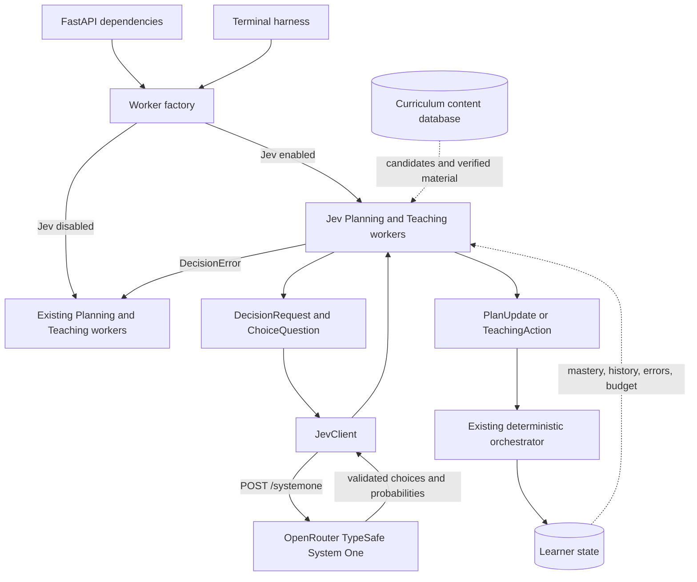
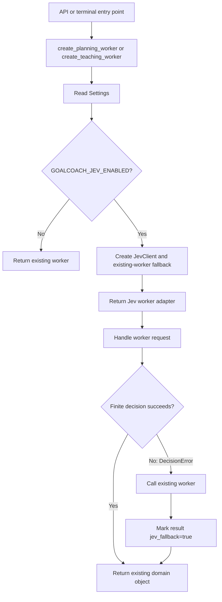
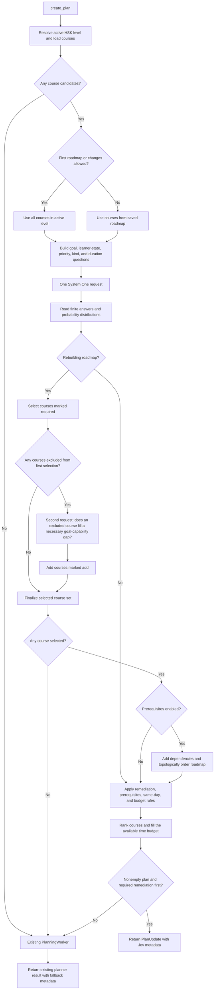
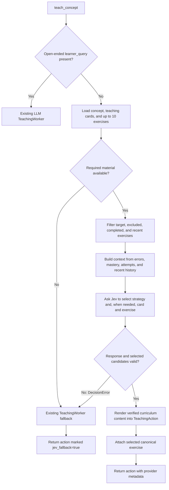

# JEV Implementation Changelog and Technical Guide

Comparison: `main...JEV`

Commit: `f83840c` (`Add Jev finite decision planning and teaching`)

This document describes the branch changes and the implementation plan, architecture, request flows, configuration, and operational boundaries. “Jev” refers to TypeSafe System One's finite-choice decision API. It receives a bounded set of candidates and returns choices with probability distributions. GoalCoach remains responsible for business rules, curriculum data, domain objects, learner state, and persistence.

## Goals and implementation plan

The integration assigns two decision classes with explicit candidate sets to Jev:

- Roadmap inclusion and daily-plan prioritization.
- Routine teaching strategy, teaching-card, and exercise selection from existing curriculum material.

Free-text learning goals are passed to Jev as context for choosing among existing courses; Jev returns finite choices rather than generated goal-analysis prose or new curriculum content. Open-ended learner questions, generative teaching content, and grading remain on the existing LLM or deterministic paths.

The implementation was delivered in these steps:

1. Define typed finite-choice requests, questions, answers, probability distributions, and a client interface.
2. Implement the OpenRouter System One client with response, question-ID, and candidate-set validation, plus diagnostics that omit learner input and response bodies.
3. Add Planning and Teaching adapters that translate curriculum and learner state into finite-choice questions and compose the results into the existing `PlanUpdate` and `TeachingAction` domain objects.
4. Route API and terminal-harness worker creation through one configurable factory, retaining the existing workers as Jev failure fallbacks.
5. Improve structured-output compatibility, provider-response checks, and diagnostics for the generative LLM paths that remain in use.
6. Test the protocol, planning and teaching behavior, fallback boundaries, and a complete learning cycle.

## Architecture and responsibility boundaries



- **Decision contract:** `src/goalcoach/application/decisions/contracts.py` defines immutable `DecisionRequest`, `ChoiceQuestion`, `DecisionResponse`, and `ChoiceAnswer` models, plus the `DecisionClient` Protocol. Candidate keys and descriptions are sent in `criteria`; each answer includes a selected key, confidence, and a probability for every candidate.
- **Provider boundary:** `src/goalcoach/infrastructure/llm/jev_client.py` implements `JevClient`. It serializes the request to the configured `systemone` endpoint and validates the response schema, exact question-ID set, and exact candidate-key set. `ChoiceAnswer` also requires the selected option to have maximal probability and the distribution to sum to approximately 1 (tolerance 0.02).
- **Business adapters:** `src/goalcoach/agents/jev_planning.py` and `jev_teaching.py` translate finite decisions into existing domain objects. They preserve the orchestrator's event interface and do not persist learner state themselves.
- **Worker composition:** `src/goalcoach/agents/worker_factory.py` chooses Jev or the existing worker using `GOALCOACH_JEV_ENABLED`. When Jev is enabled, the existing worker is still injected as a fallback. API dependencies and the terminal harness share this factory.
- **Authoritative data:** Course candidates, teaching cards, and exercises come from the content service. Mastery, errors, repetition constraints, and time budgets come from `LearnerState`. Jev chooses only among supplied candidates; application code builds the final domain result.
- **Grading:** Grading is not routed through Jev. The existing `GraderComponent` and its deterministic fallback remain responsible for grading.

## Runtime workflows

### Worker initialization and routing



`create_planning_worker()` and `create_teaching_worker()` each read `Settings`. With Jev disabled they return the existing worker directly. With Jev enabled they create a `JevClient` and pass the existing worker to the Jev adapter as its fallback. A failure inside the fallback itself propagates to the caller.

### Roadmap selection and daily planning

`JevPlanningWorker.create_plan()` catches `DecisionError` around its Jev planning path. It then calls the existing `PlanningWorker.create_plan()`, preserving `allow_roadmap_changes`, and marks the result metadata with `jev_fallback=true`.



The planning sequence is:

1. Resolve the active HSK level from learner state and curriculum data, then load courses within that level. No candidates causes a fallback.
2. Rebuild the roadmap on initial planning or when `allow_roadmap_changes=true`. During ordinary replanning, preserve the saved roadmap and make daily decisions only over its available courses.
3. Build context with the goal title, mastery, retention, review-due state, and remediation counters. For each course, include its communicative goal, grammar focus, and vocabulary focus. Ask for roadmap inclusion during a rebuild, and ask every candidate for priority, activity kind, and duration. Choices are `high/medium/low`, `new/review/remedial`, and `3/4/5` minutes.
4. Send the first request. During a rebuild, initially include only courses answered `required`. Rank daily priority using `2 * P(high) + P(medium)`; there is no hard confidence threshold.
5. If a rebuild left courses unselected, send a second request asking whether each one supplies a necessary goal capability missing from the selected set. Add courses answered `add`. This is the implemented “identify and fill missing courses” pass; there is no separate whole-roadmap coverage-verdict request. The second call is skipped when no course was excluded.
6. If no course is selected after the second pass, fall back. When prerequisites are enabled, recursively add prerequisites and topologically order the roadmap. Missing prerequisites or dependency cycles cause fallback. Ordinary replanning retains the existing roadmap and order.
7. Enforce daily constraints in application code. A roadmap concept with a remediation counter of at least 2 is mandatory remediation. Concepts already studied or remediated today are excluded from ordinary daily work. When prerequisites are enabled, a new course must satisfy prerequisite mastery or same-day remediation conditions. Mandatory remediation comes first.
8. Add tasks in probability-ranked order until the budget is exhausted. Use Jev's 3–5 minute duration choice, capped by remaining budget; mandatory remediation without a matching candidate defaults to 5 minutes. The application builds each `PlanItem` objective from the curriculum communicative goal. An empty plan or one that violates mandatory-remediation order triggers fallback.
9. Return the existing `PlanUpdate` shape. Successful metadata includes `provider=typesafe:<response.model>`, `roadmap_source=jev`, `fallback_used=false`, and IDs of courses added by the gap pass.

Roadmap selection and daily ordering operate at different scopes: the roadmap defines the long-term course set, while the daily plan selects budget-bounded tasks from that set. Prerequisites, remediation, same-day repetition, and time budgets remain application-enforced rules.

### Routine teaching

`JevTeachingWorker.teach_concept()` retains the existing teaching interface. When `learner_query` is present, it delegates directly to the existing `TeachingWorker` and does not call Jev.



The teaching sequence is:

1. Load the concept, teaching cards, and up to 10 exercises. Missing any required candidate category triggers fallback.
2. If `target_exercise_id` is set, retain only that exercise. Otherwise exclude the caller-specified exercise and exercises completed today; prefer candidates absent from recent teaching history, falling back to the still-valid set if needed.
3. Send failed-attempt count, mastery, error codes, up to three recent teaching turns for the concept, and exercise prompts to Jev. The strategy choices are `EXPLANATION`, `HINT`, `CONTRAST_EXAMPLE`, `RETRY`, and `DIALOGUE`. When multiple cards or exercises exist, ask Jev to choose those too. Candidate keys map back to local array indexes, so Jev does not provide arbitrary database IDs.
4. Map the response to curriculum records and compose a `TeachingAction` from the card explanation, vocabulary, pinyin, meaning, example, and exercise instruction. Jev selects the approach and material; the application renders verified content rather than asking Jev to write a new explanation.
5. Attach the exercise through the existing `TeachingWorker._attach_selected_exercise()` helper. Successful metadata includes `provider=typesafe:<response.model>`, `fallback_used=false`, the teaching-card ID, and strategy confidence.
6. A `DecisionError` delegates to the existing Teaching Worker and marks the result `jev_fallback=true`. Open-ended learner questions are an intentional product route to the existing tutor, not a Jev failure.

## Jev API contract, validation, and diagnostics

The client sends `POST {GOALCOACH_JEV_BASE_URL}/systemone`. The JSON body contains `model`, `state`, and `questions`; authorization uses a Bearer token. With the default base URL, the endpoint is `https://openrouter.ai/api/v1/systemone`.

The client rejects malformed JSON or response schemas, missing or extra question answers, unknown candidate keys, and invalid probability distributions. Validation logs contain HTTP status, response byte count, error count, and allow-listed field paths. Request-completion logs contain question count, status, and duration. These diagnostics do not include learner input, response bodies, or API keys. HTTP errors, Pydantic validation failures, and candidate mismatches become `DecisionError`; the worker decides whether to fall back.

Each `decide()` call creates and closes its own `httpx.AsyncClient`. A second roadmap-gap request is therefore a separate sequential HTTP call and does not reuse the first call's client connection.

## Configuration and operation

Set these values in the application `.env` and restart the backend:

```env
GOALCOACH_JEV_ENABLED=true
GOALCOACH_JEV_API_KEY=your-openrouter-api-key
GOALCOACH_JEV_BASE_URL=https://openrouter.ai/api/v1
GOALCOACH_JEV_MODEL=typesafe/jev-1.13
GOALCOACH_JEV_TIMEOUT_SECONDS=10
```

Create the key in OpenRouter API Keys. Jev settings are separate from `GOALCOACH_LLM_*`; the same OpenRouter key may be used for both, but `GOALCOACH_JEV_API_KEY` must be set explicitly. Set `GOALCOACH_JEV_ENABLED=false` to use the original Planning and Teaching workers. Defaults are defined in `src/goalcoach/infrastructure/config.py`; examples are in `.env.example`.

## Related generative LLM output changes in this branch

The following `main...JEV` changes were committed alongside the Jev integration. They support generative Planning, Teaching, and Grading, and Jev failure fallbacks; they are separate from the finite-choice System One protocol.

- The `pydantic-ai` dependency is constrained to `>=1.30.1,<2`. A `structured_output.py` adapter adds `GOALCOACH_LLM_OUTPUT_MODE=auto|tool|text` to accept tool output, text JSON, or both.
- The structured text path validates with Pydantic and issues `ModelRetry` with invalid-field details when output does not match the schema. The JSON sanitizer handles code fences, surrounding text, double encoding, and stringified nested values.
- Planning uses dedicated `AgentPlanUpdate` and `AgentPlanItem` schemas. The application creates execution IDs and defaults so the model cannot override metadata or execution state. The model receives a smaller typed curriculum catalog.
- OpenRouter chat completions receive provider-error/empty-response checks, bounded retries for transient failures, and HTTP/tool-call diagnostics that omit model content. Grading uses typed `GradingResult` output and retains deterministic fallback.
- The learner-profile drawer disables closing while saving/planning and displays `Planning…`. This UI change is adjacent to, but independent from, the Jev API.

## Main implementation files

| File | Responsibility |
|---|---|
| `src/goalcoach/application/decisions/contracts.py` | Finite-choice request/response models, validation, and client Protocol |
| `src/goalcoach/infrastructure/llm/jev_client.py` | OpenRouter System One HTTP client, candidate validation, safe diagnostics |
| `src/goalcoach/agents/jev_planning.py` | Roadmap selection, gap fill, daily planning, Planning fallback |
| `src/goalcoach/agents/jev_teaching.py` | Strategy/card/exercise selection, curriculum rendering, Teaching fallback |
| `src/goalcoach/agents/worker_factory.py` | Select Jev or existing workers from settings |
| `apps/api/dependencies.py`, `src/goalcoach/agents/terminal_harness.py` | Use the same factory in API and terminal entry points |
| `src/goalcoach/infrastructure/config.py`, `.env.example` | Jev and generative-model configuration |
| `src/goalcoach/infrastructure/llm/structured_output.py`, `json_sanitizer.py` | Generative structured output and JSON normalization |
| `src/goalcoach/infrastructure/llm/pydantic_ai_models.py` | OpenRouter/Ollama adapters, response guard, retries, HTTP diagnostics |
| `src/goalcoach/agents/planning_agent.py`, `grader_component.py` | Typed Planning/Grading outputs and validation |
| `pyproject.toml`, `uv.lock` | PydanticAI version constraint and lockfile update |
| `apps/web/src/App.tsx`, `apps/web/src/components/LearnerProfileDrawer.tsx` | Drawer and button behavior while saving/planning |
| `tests/unit/test_jev_workers.py`, `test_model_adapters.py` | Jev workflows, model adapters, failure boundaries, closed-loop coverage |

## Validation and observability

The branch's recorded verification results are: backend `180 passed`, Ruff checks passed, and `npm run build` passed. Jev tests cover the System One URL/request contract, missing API key, answer and candidate validation, probability ranking without a confidence gate, second-pass roadmap gap filling, prerequisite configuration, daily budget and mandatory remediation, teaching exercise/card selection, open-ended questions routed to the existing tutor, and a learning cycle through the real orchestrator.

At runtime, inspect `Jev decision request`, `Jev planning fallback`, and `Jev teaching fallback` logs. Successful result metadata uses `typesafe:<model>`; fallback results carry `jev_fallback=true`. Correlate these with the request ID and API duration. A fallback invokes the existing LLM and may add latency. The roadmap gap pass also adds a second sequential System One request.

## Behavior boundaries and follow-up evaluation

- Jev can choose only among candidates included in the request. It cannot create a course, teaching card, or exercise absent from the content database.
- The second roadmap pass checks whether excluded courses fill a necessary goal-capability gap. It is not an independent course reviewer and cannot guarantee that the curriculum itself covers every arbitrary free-text goal.
- Ordinary replanning preserves the saved roadmap. Course selection runs only for initial roadmap creation or when roadmap changes are explicitly allowed.
- Open-ended learner questions and grading remain on existing generative/deterministic paths. Jev teaching selects a strategy and canonical curriculum material.
- Enabling Jev does not guarantee lower latency on every request. A new roadmap may make two sequential Jev calls. The configured 10-second timeout applies per HTTP request, not to the entire event.
- Automated tests validate contracts and behavior with simulated decisions; they do not establish OpenRouter availability, live latency, relevance for arbitrary goals, or production quality. Evaluate live latency, fallback rate, roadmap relevance for representative goals, day rollover, and error/remediation scenarios before relying on it as a production policy.
