# Implementation Plan: Eliminating the Remediation Loop Bug & Exercise Stagnation

**Target Location:** `docs/dev/REMEDIATION_LOOP_BUG_FIX_PLAN.md`  
**Author:** Principal Senior Software Engineer (Systems & AI Architecture)  
**Date:** September 16, 2026  
**Status:** Pending Review / Plan Mode  

---

## 1. Goal Description

During closed-loop testing of the agentic tutoring system, when a learner submits 3 incorrect answers for a concept (e.g. `hsk1_c01`), they enter remediation. Under the current implementation, the system exhibits four compounding defects:
1. **Exercise Stagnation:** It presents the exact same simple question (`hsk1_c01_e01`) 3 times in a row because exercise fetching hardcodes `limit=1, randomize=False` without tracking completed items.
2. **The Stepping Gap Trap:** It demands 3 consecutive successful turns to escape the `< 0.60` heuristic threshold because mastery only increments by `+0.25` per pass ($0.0 \to 0.25 \to 0.50 \to 0.75$).
3. **Ghost Error Profile:** It never decrements or clears `state.error_profile`, causing both the LLM and heuristic planners to treat the concept as permanently defective.
4. **Blind Ingress Modality:** It hardcodes `failed_attempts=0` at `SESSION_STARTED`, preventing the Teaching Worker from adapting away from basic `EXPLANATION`.

This change accomplishes a complete, structural fix:
- **Dynamic exercise rotation** with attempt history memory.
- **Error profile lifecycle management** (error decrement and resolution upon passing rubrics).
- **Failure history propagation** during session ingress so the Teaching Agent adapts modality.
- **Planner progression guards** decoupling remedial re-scheduling from raw mastery score once today's remediation has succeeded.

---

## 2. Architecture Comparison: Broken vs. Fixed

```mermaid
flowchart TD
    subgraph CurrentBehavior ["Current Broken Loop"]
        A1["Wrong Answer x3"] --> B1["error_profile occurrences = 3<br/>needs_replanning = True"]
        B1 --> C1["Planner adds REMEDIAL item<br/>hsk1_c01"]
        C1 --> D1["SESSION_STARTED passes failed_attempts=0"]
        D1 --> E1["Teacher always picks hsk1_c01_e01<br/>(limit=1, randomize=False)"]
        E1 --> F1["User passes: mastery += 0.25 (0.0 -> 0.25)"]
        F1 --> G1["mastery 0.25 is < 0.60<br/>error_profile still has occurrences=3!"]
        G1 --> C1
    end

    subgraph ProposedBehavior ["Proposed Hardened Architecture"]
        A2["Wrong Answer x3"] --> B2["error_profile occurrences = 3<br/>needs_replanning = True"]
        B2 --> C2["Planner slots REMEDIAL item<br/>hsk1_c01"]
        C2 --> D2["SESSION_STARTED detects REMEDIAL kind<br/>Passes real failed_attempts & error tag"]
        D2 --> E2["Teaching Worker adapts modality<br/>(CONTRAST_EXAMPLE / HINT)"]
        E2 --> F2["Exercise Selection rotates to uncompleted items:<br/>hsk1_c01_e02 or targeted remedial exercise"]
        F2 --> G2["User passes gating rubric"]
        G2 --> H2["ProgressService decrements error_profile<br/>today_completed_exercise_ids.append(ex_id)"]
        H2 --> I2["Concept marked remediated for today<br/>Planner advances to next curriculum concept"]
    end
```



---

## 3. User Review Required

> [!IMPORTANT]
> **Error Profile Decay Semantics:** When a learner passes a gating assessment during remediation, we will decrement the error `occurrences` by 1. If `occurrences` reaches 0 (or $\le 1$ when gating passed), the error is purged from `state.error_profile`. This cleanly terminates the repeated-error replanning trigger without losing diagnostic history in the immutable learning event audit log.

> [!IMPORTANT]
> **Database Initialization Requirement:** `data/database1/goalcoach_hsk1_learning.db` is currently an empty 0-byte file in this working copy. The canonical SQLite tables and 80+ HSK1 exercises are stored in `data/database1/GoalCoach_HSK1_Learning_DB_Package/data/goalcoach_hsk1_learning_db_sqlite.sql` and the zipped package. We will initialize this database file as part of the verification process so real exercise rotation (`e01` $\to$ `e02` $\to$ `e03`) executes against live data.

> [!NOTE]
> **Remedial Exercise Progression:** When in remediation, the system will prioritize exercises that haven't been completed today (`state.today_completed_exercise_ids`), and if available, exercises tagged with the detected error taxonomy (e.g., `vocab_recall`, `dialogue`).

---

## 4. Proposed Code Changes

### Component 1: Domain Layer
#### [MODIFY] [`src/goalcoach/domain/models.py`](file:///Users/MusabKaya/Documents/GoalCoach/src/goalcoach/domain/models.py)
- In `LearnerState`:
  ```python
  today_completed_exercise_ids: list[str] = Field(default_factory=list)
  today_remediated_concept_ids: list[str] = Field(default_factory=list)
  ```
- Add helper method `all_attempted_exercise_ids(self) -> set[str]` returning the union of completed and mistake exercise IDs for today.

---

### Component 2: Application Layer
#### [MODIFY] [`src/goalcoach/application/progress_service.py`](file:///Users/MusabKaya/Documents/GoalCoach/src/goalcoach/application/progress_service.py)
- In `apply_grading_result`:
  - When `result.passed_gates` is True:
    - Add `result.exercise_id` to `state.today_completed_exercise_ids`.
    - **Resolve / Decay Errors:** For all records in `state.error_profile` matching `concept_id`:
      ```python
      err.occurrences -= 1
      ```
    - Purge resolved records:
      ```python
      state.error_profile = [e for e in state.error_profile if e.occurrences > 0]
      ```
    - If `state.active_plan`: if the completed item was `PlanItemKind.REMEDIAL`, add `concept_id` to `state.today_remediated_concept_ids`.
    - If no recurring errors remain (`occurrences >= 2`), ensure `state.needs_replanning = False`.

#### [MODIFY] [`src/goalcoach/application/orchestrator.py`](file:///Users/MusabKaya/Documents/GoalCoach/src/goalcoach/application/orchestrator.py)
- In `_handle_session_started`:
  - Check if `active_item.kind == PlanItemKind.REMEDIAL`.
  - Calculate real failure count from `state.error_profile`:
    ```python
    failed_attempts = sum(
        err.occurrences for err in state.error_profile if err.concept_id == concept_id
    )
    if active_item.kind == PlanItemKind.REMEDIAL and failed_attempts == 0:
        failed_attempts = 1
    ```
  - Forward `failed_attempts` into `teaching_worker.teach_concept`.
- In `_handle_answer_submitted`:
  - When a remedial item passes, verify `state.needs_replanning` is reset to False so the learner is not trapped in immediate re-planning.

---

### Component 3: Agent Layer
#### [MODIFY] [`src/goalcoach/agents/teaching_agent.py`](file:///Users/MusabKaya/Documents/GoalCoach/src/goalcoach/agents/teaching_agent.py)
- Refactor `_attach_curriculum_exercise`:
  ```python
  @staticmethod
  def _attach_curriculum_exercise(
      action: TeachingAction,
      content_service: ContentService,
      state: LearnerState | None = None,
      is_remedial: bool = False,
  ) -> TeachingAction:
      all_exercises = content_service.get_exercises_for_concept(
          action.concept_id,
          limit=10,
          randomize=False,
      )
      if not all_exercises:
          raise LookupError(f"No curriculum exercise found for concept {action.concept_id}")

      # Exclude completed exercises
      completed = set(state.today_completed_exercise_ids) if state else set()
      uncompleted = [e for e in all_exercises if e.exercise_id not in completed]
      
      # Select exercise
      selected = uncompleted[0] if uncompleted else all_exercises[0]
      ...
  ```
- In `TeachingWorker.teach_concept`:
  - Pass `state` and `is_remedial=(failed_attempts > 0)` to `_attach_curriculum_exercise`.
  - Update `TEACHING_SYSTEM_PROMPT` to enforce `CONTRAST_EXAMPLE` or `HINT` when in remediation.

#### [MODIFY] [`src/goalcoach/agents/planning_agent.py`](file:///Users/MusabKaya/Documents/GoalCoach/src/goalcoach/agents/planning_agent.py)
- In `_heuristic_fallback`:
  - Only add `cid` to `remedial_candidates` if:
    1. `cid not in state.today_remediated_concept_ids`; AND
    2. It has active recurring errors (`occurrences >= 2`) OR (`mastery_score < 0.60` AND `cid not in state.today_studied_concept_ids`).
  - Move to next prerequisite-valid concept when remedial concept is completed.
- In `PlanningWorker.create_plan`:
  - Add deterministic DAG prerequisite validation to prevent scheduling concepts whose prerequisites in `state.mastery` are $< 0.50$.

---

## 5. Verification Plan

### Automated Testing
1. **Populate Database #1 from canonical SQL:**
   ```bash
   sqlite3 data/database1/goalcoach_hsk1_learning.db < data/database1/GoalCoach_HSK1_Learning_DB_Package/data/goalcoach_hsk1_learning_db_sqlite.sql
   ```
2. **New Dedicated Integration Test File:** `tests/integration/test_remediation_loop.py`
   - `test_remediation_triggers_after_repeated_errors`: Validates `needs_replanning` and remedial item slotting.
   - `test_remediation_exercise_rotates_and_does_not_repeat_e01`: Validates that turn 2 or remedial turn serves `e02` or `e03`.
   - `test_remediation_success_clears_error_profile`: Validates error decrement and removal on pass.
   - `test_curriculum_advances_after_remediation_without_infinite_loop`: Validates progression to `hsk1_c02` rather than re-scheduling `hsk1_c01`.
3. **Regression Suite:**
   ```bash
   pytest tests/integration/test_closed_loop.py tests/unit -q
   ```

### Manual CLI Walkthrough
1. Launch `python -m goalcoach.agents.terminal_harness`.
2. Fail 2–3 times deliberately.
3. Verify:
   - Yellow alert box appears: *"ALERT: Repeated error threshold reached!"*
   - Teaching modality switches to `CONTRAST_EXAMPLE` or `HINT`.
   - Practice box shows prompt #2 (e.g. `Goodbye`) instead of repeating prompt #1 (`你好`).
4. Submit correct answer:
   - Receives green PASS.
   - State table shows error decremented.
   - Next plan item moves forward in curriculum rather than restarting the remedial loop.
