# Architecture Implementation Plan: Eliminating the Remediation Loop Bug & Hardening the Remediation Engine

**Target Location:** `docs/dev/REMEDIATION_LOOP_BUG_FIX_PLAN.md`  
**Author:** Principal Senior Software Engineer (Systems & AI Architecture)  
**Date:** September 17, 2026  
**Status:** Plan Approved for Documentation / Implementation Pending User Approval  

---

## 1. Goal Description

During closed-loop learning sessions in GoalCoach, when a learner submits 2–3 incorrect answers for an HSK1 concept (e.g., `hsk1_c01`), they enter remediation. Under the current implementation, four compounding defects trigger a catastrophic loop:

1. **Exercise Stagnation:** Exercise attachment in `TeachingWorker._attach_curriculum_exercise` hardcodes `limit=1, randomize=False` without tracking completed or failed exercises. The learner is repeatedly served `hsk1_c01_e01` across every turn.
2. **The Stepping Gap Trap:** Mastery increments by only `+0.25` per pass ($0.0 \to 0.25 \to 0.50 \to 0.75$). Both the heuristic and LLM planners require $\ge 0.60$ (or $\ge 0.50$ for prerequisites) to consider a concept learned or to unlock downstream concepts. Because the learner's score is only $0.25$ after passing remediation, the planner immediately re-schedules `hsk1_c01` for remediation.
3. **Ghost Error Profile & Turn-Level Replanning Trap:** `ProgressService.apply_grading_result` never decrements or clears `state.error_profile` on pass. Furthermore, the check `for err in state.error_profile: if err.occurrences >= 2: state.needs_replanning = True` runs unconditionally (even on pass). As a result, immediately after passing a remedial exercise, `needs_replanning` is set back to `True`, triggering an instant re-planning cascade on the exact same turn.
4. **Blind Ingress Modality:** `DeterministicOrchestrator._handle_session_started` hardcodes `failed_attempts=0`, preventing the Teaching Worker from adapting away from basic `EXPLANATION` into `CONTRAST_EXAMPLE` or `HINT`.

This implementation plan delivers an enterprise-grade, deterministic resolution:
- **Dynamic exercise rotation** with attempt and completion history memory.
- **Error profile lifecycle management** (clean decrement and resolution upon passing rubrics, decoupling replanning triggers from successful turns).
- **Failure history propagation** during session ingress so teaching modalities adapt dynamically.
- **Prerequisite DAG progression guards** that recognize concepts remediated today to unlock downstream curriculum items without infinite loops.
- **Canonical SQLite Database #1 initialization** from SQL sources.
- **Comprehensive edge-case stress test suite** verifying multi-error resolution, exercise exhaustion, DAG cascades, and state persistence.

---

## 2. Architecture Comparison: Broken vs. Hardened Remediation Engine

```mermaid
flowchart TD
    subgraph CurrentBrokenLoop ["Current Defective Loop"]
        A1["Fail Answer x2 or x3"] --> B1["error_profile occurrences = 2+<br/>needs_replanning = True"]
        B1 --> C1["Planner slots REMEDIAL item<br/>hsk1_c01"]
        C1 --> D1["SESSION_STARTED passes failed_attempts=0"]
        D1 --> E1["Teacher serves hsk1_c01_e01<br/>(limit=1, randomize=False)"]
        E1 --> F1["Learner passes: mastery 0.0 -> 0.25"]
        F1 --> G1["Ghost Error: occurrences still 2+!<br/>apply_grading_result sets needs_replanning = True on PASS!"]
        G1 --> H1["0.25 < 0.60 threshold trap: planner re-slots hsk1_c01"]
        H1 --> C1
    end

    subgraph HardenedEngine ["Hardened Enterprise Engine"]
        A2["Fail Answer x2 or x3"] --> B2["error_profile occurrences = 2+<br/>needs_replanning = True"]
        B2 --> C2["Planner slots REMEDIAL item<br/>hsk1_c01"]
        C2 --> D2["SESSION_STARTED inspects error_profile<br/>Passes real failed_attempts & error context"]
        D2 --> E2["Teaching Worker adapts modality<br/>(CONTRAST_EXAMPLE / HINT / RETRY)"]
        E2 --> F2["Exercise Selection rotates:<br/>Picks unattempted item (e02) or uncompleted"]
        F2 --> G2["Learner passes gating rubric"]
        G2 --> H2["ProgressService resolves errors for concept<br/>today_completed_exercise_ids.append(ex_id)<br/>today_remediated_concept_ids.append(concept_id)<br/>needs_replanning = False"]
        H2 --> I2["DAG Planner validates hsk1_c01 remediated today<br/>Unlocks hsk1_c02 without stepping gap trap!"]
        I2 --> J2["Session 2 advances to hsk1_c02"]
    end
```



---

## 3. User Review Required

> [!IMPORTANT]
> **Database Initialization Requirement:** `data/database1/goalcoach_hsk1_learning.db` is currently an empty 0-byte file in this working tree. As specified in Section 3 of `REMEDIATION_LOOP_BUG_FIX_PLAN.md`, we will populate it using:
> ```bash
> sqlite3 data/database1/goalcoach_hsk1_learning.db < data/database1/GoalCoach_HSK1_Learning_DB_Package/data/goalcoach_hsk1_learning_db_sqlite.sql
> ```
> This creates the 20 curriculum concepts, 80+ teaching cards, 80+ exercises, and prerequisite dependency graph required by live tests and runtime.

> [!IMPORTANT]
> **Error Profile Decay & Resolution Semantics:**
> - When `result.passed_gates` is True for a `REMEDIAL` plan item, all errors for `concept_id` in `state.error_profile` are cleanly resolved (`occurrences = 0`) and purged, and `concept_id` is appended to `state.today_remediated_concept_ids`.
> - For non-remedial passes, errors for `concept_id` decrement by 1 (`err.occurrences -= 1`), purging any where `occurrences <= 0`.
> - The `needs_replanning = True` threshold check is strictly moved inside the failure branch (`if not result.passed_gates:`), eliminating the bug where passing an answer set `needs_replanning = True`.

> [!NOTE]
> **DAG Prerequisite Progression Policy:**
> When evaluating whether concept $B$ (e.g. `hsk1_c02`) can be planned, each prerequisite $A$ (e.g. `hsk1_c01`) is considered met if:
> `(A in state.mastery and state.mastery[A].mastery_score >= 0.50) or (A in state.today_remediated_concept_ids)`
> This breaks the "Stepping Gap Trap" where a remediated concept with mastery $0.25$ would otherwise block curriculum progression and force infinite loops.

---

## 4. Proposed Code Changes Grouped by Component

---

### Component 1: Domain Models Layer

#### [MODIFY] [`src/goalcoach/domain/models.py`](file:///Users/MusabKaya/Documents/GoalCoach/src/goalcoach/domain/models.py)
- In `LearnerState`:
  - Add `today_completed_exercise_ids: list[str] = Field(default_factory=list)`
  - Add `today_remediated_concept_ids: list[str] = Field(default_factory=list)`
  - Add helper method:
    ```python
    def all_attempted_exercise_ids(self) -> set[str]:
        """Returns union of completed and mistake exercise IDs attempted today."""
        return set(self.today_completed_exercise_ids) | set(self.today_mistake_exercise_ids)
    ```

---

### Component 2: Application Layer (State Mutations & Orchestration)

#### [MODIFY] [`src/goalcoach/application/progress_service.py`](file:///Users/MusabKaya/Documents/GoalCoach/src/goalcoach/application/progress_service.py)
- Refactor `apply_grading_result`:
  - In `if result.passed_gates:`:
    - Record exercise completion:
      ```python
      ex_id = str(result.exercise_id)
      if ex_id not in state.today_completed_exercise_ids:
          state.today_completed_exercise_ids.append(ex_id)
      ```
    - Check if active item was remedial:
      ```python
      is_remedial_item = False
      if state.active_plan:
          for item in state.active_plan.items:
              if item.concept_id == concept_id and not item.completed:
                  if item.kind == PlanItemKind.REMEDIAL:
                      is_remedial_item = True
                  break

      if is_remedial_item and concept_id not in state.today_remediated_concept_ids:
          state.today_remediated_concept_ids.append(concept_id)
      ```
    - Error profile resolution/decay:
      ```python
      for err in state.error_profile:
          if err.concept_id == concept_id:
              if is_remedial_item:
                  err.occurrences = 0
              else:
                  err.occurrences -= 1

      state.error_profile = [e for e in state.error_profile if e.occurrences > 0]
      has_recurring = any(e.occurrences >= 2 for e in state.error_profile)
      if not has_recurring:
          state.needs_replanning = False
      ```
  - In `else:` (failure branch):
    - Keep mastery decrement, mistake exercise tracking, error recording.
    - Move `state.needs_replanning = True` check **inside** this failure branch exclusively:
      ```python
      for err in state.error_profile:
          if err.concept_id == concept_id and err.occurrences >= 2:
              state.needs_replanning = True
              logger.info(
                  "Threshold reached for error %s on concept %s (occurrences: %d); set needs_replanning=True",
                  err.code,
                  concept_id,
                  err.occurrences,
              )
              break
      ```

#### [MODIFY] [`src/goalcoach/application/orchestrator.py`](file:///Users/MusabKaya/Documents/GoalCoach/src/goalcoach/application/orchestrator.py)
- In `_handle_session_started`:
  - Detect remedial item and derive real `failed_attempts`:
    ```python
    active_item = next((item for item in plan.items if not item.completed), plan.items[0])
    concept_id = active_item.concept_id

    failed_attempts = sum(
        err.occurrences for err in state.error_profile if err.concept_id == concept_id
    )
    if active_item.kind == PlanItemKind.REMEDIAL and failed_attempts == 0:
        failed_attempts = 1
    ```
  - Forward `failed_attempts` into `teaching_worker.teach_concept`.
- In `_deterministic_fallback_plan`:
  - Mirror the hardened candidate filtering:
    - Only add remedial candidates if `cid not in state.today_remediated_concept_ids`.
    - Check prerequisite satisfaction before adding new concepts.

---

### Component 3: Agent Layer (Teaching Rotation & Planning DAG)

#### [MODIFY] [`src/goalcoach/agents/teaching_agent.py`](file:///Users/MusabKaya/Documents/GoalCoach/src/goalcoach/agents/teaching_agent.py)
- In `_attach_curriculum_exercise`:
  ```python
  @staticmethod
  def _attach_curriculum_exercise(
      action: TeachingAction,
      content_service: ContentService,
      state: LearnerState | None = None,
      is_remedial: bool = False,
  ) -> TeachingAction:
      all_exercises = content_service.get_exercises_for_concept(
          action.concept_id,
          limit=10,
          randomize=False,
      )
      if not all_exercises:
          raise LookupError(f"No curriculum exercise found for concept {action.concept_id}")

      completed = set(state.today_completed_exercise_ids) if state else set()
      mistakes = set(state.today_mistake_exercise_ids) if state else set()

      if is_remedial:
          # In remediation: prioritize exercises never attempted today (neither completed nor failed)
          candidates = [e for e in all_exercises if e.exercise_id not in completed and e.exercise_id not in mistakes]
          if not candidates:
              # If all exercises have been attempted, pick one not yet completed
              candidates = [e for e in all_exercises if e.exercise_id not in completed]
          selected = candidates[0] if candidates else all_exercises[0]
      else:
          uncompleted = [e for e in all_exercises if e.exercise_id not in completed]
          selected = uncompleted[0] if uncompleted else all_exercises[0]

      payload = dict(action.exercise_payload or {})
      payload.update(
          {
              "exercise_id": selected.exercise_id,
              "concept_id": selected.concept_id,
              "prompt": selected.prompt,
              "instruction": selected.instruction or "",
          }
      )
      action.exercise_payload = payload
      return action
  ```
- In `TeachingWorker.teach_concept`:
  - Pass `state=state, is_remedial=(failed_attempts > 0)` to both LLM and fallback branches calling `_attach_curriculum_exercise`.

#### [MODIFY] [`src/goalcoach/agents/planning_agent.py`](file:///Users/MusabKaya/Documents/GoalCoach/src/goalcoach/agents/planning_agent.py)
- In `_heuristic_fallback`:
  - Update `remedial_candidates` logic:
    ```python
    remedial_candidates: list[str] = []
    if state.needs_replanning and state.error_profile:
        sorted_errors = sorted(state.error_profile, key=lambda e: e.occurrences, reverse=True)
        for e in sorted_errors:
            if e.concept_id not in state.today_remediated_concept_ids and e.concept_id not in remedial_candidates:
                remedial_candidates.append(e.concept_id)

    for cid, m in state.mastery.items():
        if (
            m.mastery_score < 0.60
            and cid not in state.today_remediated_concept_ids
            and cid not in state.today_studied_concept_ids
            and cid not in remedial_candidates
        ):
            remedial_candidates.append(cid)
    ```
  - Update prerequisite satisfaction in New Concepts:
    ```python
    prereqs = prereq_graph.get(cid, frozenset())
    prereqs_met = all(
        (
            p in state.mastery
            and (
                state.mastery[p].mastery_score >= 0.50
                or p in state.today_remediated_concept_ids
            )
        )
        for p in prereqs
    )
    ```
- In `PlanningWorker.create_plan`:
  - Add deterministic DAG prerequisite verification for items output by LLM:
    ```python
    # Guardrail: Validate prerequisites for scheduled NEW concepts
    prereq_graph = content_service.get_all_prerequisites()
    validated_items = []
    for item in budgeted_items:
        if item.kind == PlanItemKind.NEW:
            prereqs = prereq_graph.get(item.concept_id, frozenset())
            prereqs_met = all(
                (p in state.mastery and (state.mastery[p].mastery_score >= 0.50 or p in state.today_remediated_concept_ids))
                for p in prereqs
            )
            if not prereqs_met:
                continue
        validated_items.append(item)
    ```

---

## 5. Verification Plan & Edge-Case Stress Testing

### 1. Database Initialization
Execute:
```bash
sqlite3 data/database1/goalcoach_hsk1_learning.db < data/database1/GoalCoach_HSK1_Learning_DB_Package/data/goalcoach_hsk1_learning_db_sqlite.sql
```
Verify table row counts:
- `curriculum_concepts`: 20 rows
- `teaching_cards`: 80+ rows
- `exercises`: 80+ rows
- `concept_prerequisites`: 18 rows

### 2. New Dedicated Integration Suite: `tests/integration/test_remediation_loop.py`

| Test Case | Scenario / Invariant Verified |
| :--- | :--- |
| `test_remediation_triggers_after_repeated_errors` | Fail twice on `hsk1_c01` $\to$ `state.needs_replanning` becomes `True` $\to$ Orchestrator adapts plan to slot `REMEDIAL` for `hsk1_c01`. |
| `test_remediation_exercise_rotates_and_does_not_repeat_e01` | Learner failed `hsk1_c01_e01` $\to$ Remedial session serves `hsk1_c01_e02` (Goodbye) instead of repeating `e01`. |
| `test_remediation_success_clears_error_profile_and_resets_replanning` | Learner passes remedial exercise `hsk1_c01_e02` $\to$ `error_profile` is purged $\to$ `today_remediated_concept_ids` contains `hsk1_c01` $\to$ `needs_replanning` is `False`. |
| `test_curriculum_advances_after_remediation_without_infinite_loop` | Next `SESSION_STARTED` after remedial pass generates plan advancing to `hsk1_c02` (Self-intro) rather than trapping on `hsk1_c01`. |
| `test_edge_case_multiple_distinct_errors_for_same_concept` | **Stress Test:** Learner accumulates multiple different error codes (`ERR_VOCAB_MEANING` + `ERR_QUESTION_MA`). Remediation pass resolves all errors for that concept cleanly. |
| `test_edge_case_exercise_exhaustion_graceful_fallback` | **Stress Test:** All 4 exercises for a concept are in mistake/completed history. System wraps around safely to `all_exercises[0]` without `IndexError`. |
| `test_edge_case_zero_error_profile_remedial_ingress` | **Stress Test:** Plan item is marked `REMEDIAL`, but `state.error_profile` is empty. Orchestrator defaults `failed_attempts=1`, triggering `CONTRAST_EXAMPLE` or `HINT` instead of `EXPLANATION`. |
| `test_edge_case_prerequisite_dag_blocks_unready_and_unlocks_remediated` | **Stress Test:** `hsk1_c03` requires `hsk1_c02`. Verifies `hsk1_c03` cannot be scheduled while `hsk1_c02` has 0.0 mastery, but is unlocked once `hsk1_c02` is remediated or mastered. |
| `test_edge_case_state_persistence_and_reload_with_new_fields` | **Stress Test:** Serializes `LearnerState` with `today_completed_exercise_ids` and `today_remediated_concept_ids` into SQLite WAL and reloads, asserting lossless restoration. |

### 3. Full Regression Verification Commands
```bash
./.venv/bin/pytest tests/integration/test_remediation_loop.py -v
./.venv/bin/pytest tests/integration/test_closed_loop.py -v
./.venv/bin/pytest tests/unit -q
```
Ensure 100% test pass rate across the entire repository.
