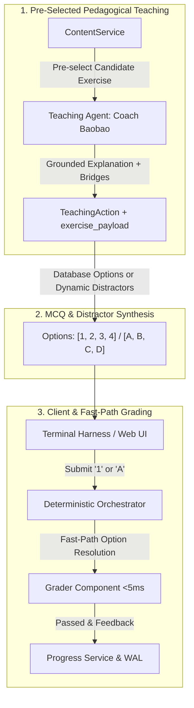

---

# Teaching Agent & Assessment Improvements: Smarter, More Precise & Humane Tutoring

**Date:** 2026-09-20  
**Contributors:** Team GoalCoach  
**Scope:** Teaching Agent (`Coach Baobao`), Grader Component, Orchestrator, Terminal Harness, Integration Tests  

---

## 1. Executive Summary & Motivations

Peer feedback identified key friction points in the interactive tutoring loop:
1. **Disconnected Explanations:** Explanations were often generic and unrelated to the exercise that immediately followed.
2. **Cold & Robotic Experience ("Naked Exercises"):** On repeated errors, the agent would throw exercises at the learner without coaching explanations or scaffolding.
3. **High Cognitive & Typing Friction:** Beginner learners were forced to type raw Hanzi / Pinyin for every question, even though Database #1 already contained multiple-choice questions (MCQs).
4. **Blank/Freeform Exercises:** Fill-in-the-blank questions lacked options, creating an unnecessary difficulty spike for beginners.

This update resolves all four issues by aligning the pedagogical loop, introducing the empathetic **Coach Baobao** persona, propagating database options, supporting 1-click answers (`1-4` / `A-D`), and dynamically synthesizing plausible HSK1 distractors for fill-in-the-blank exercises.

---

## 2. Key Architecture & Behavior Changes



### A. Context Synchronization & Pre-Selection (Fixing Relevance)
* **Problem:** Previously, the LLM generated an explanation *before* the practice exercise was selected. The LLM had zero knowledge of what the user was going to practice.
* **Solution:** `TeachingWorker` now pre-selects the upcoming candidate exercise (`_select_candidate_exercise`) and injects the `Target Upcoming Practice` directly into the agent's prompt dependencies.
* **Outcome:** Explanations directly introduce, contextualize, and prepare the learner for the practice task.

### B. Empathetic "Coach Baobao" Persona & Scaffolding
* **Problem:** The system prompt was mechanical, and the rule for `failed_attempts >= 2` instructed the LLM to choose `RETRY` or `EXERCISE`, which emitted naked questions with no teaching.
* **Solution:** 
  - Upgraded system prompt to **Coach Baobao**—an observant, warm, and encouraging tutor.
  - Banned naked exercises: on retries, Coach Baobao provides empathetic validation ("Mastering Chinese takes patience!") and breaks down the grammatical structure step-by-step before the retry.

### C. Propagation of Rich MCQ Options & 1-Click Answering
* **Problem:** Database #1 already had options for `meaning_mcq`, `en_to_zh_mcq`, and `dialogue_choice`, but `exercise_payload` was dropping the `options` and `exercise_type` fields.
* **Solution:**
  - Preserved `options` and `exercise_type` on `TeachingAction.exercise_payload` and `Exercise` domain models.
  - Enabled **1-click / index-based answering**: students can type `1`, `2`, `3`, `4` or `A`, `B`, `C`, `D`.
  - Both `GraderComponent` (fast-path) and `DeterministicOrchestrator` (deterministic fallback) resolve numbers/letters to the actual answer string in `<5ms`.

### D. Dynamic HSK1 Distractor Generation for Fill-in-the-Blank
* **Problem:** `fill_blank` questions in Database #1 did not have pre-stored options, forcing freeform typing.
* **Solution:** Added `TeachingWorker._generate_fill_blank_distractors()`:
  - Detects `fill_blank` exercises without options.
  - Generates 3 plausible HSK1 distractors from curated grammatical pools (particles: `吗, 呢, 了, 的`; verbs: `是, 叫, 有, 在`; pronouns; adverbs).
  - Inserts the correct answer at a stable, deterministic index.

### E. Terminal Harness UI Enhancement
* Rendered formatted option lists inside the green `Practice` and `Coach Guidance` panels:
  ```text
  (1) Hello
  (2) Thank you
  (3) Goodbye
  (4) Sorry
  ```
* Updated command prompts to inform users they can answer by number.

---

## 3. Summary of Code Changes by File

| File | Changes Made |
| :--- | :--- |
| `src/goalcoach/domain/models.py` | Added optional `options: list[str] \| None` field to the `Exercise` domain model. |
| `src/goalcoach/agents/teaching_agent.py` | 1. Upgraded system prompt to Coach Baobao with empathetic scaffolding.<br>2. Implemented `_select_candidate_exercise()` before agent invocation and injected target practice into the prompt.<br>3. Enriched `exercise_payload` with `exercise_type` and `options`.<br>4. Added `_generate_fill_blank_distractors()` for dynamic distractor synthesis on `fill_blank` questions.<br>5. Rewrote heuristic fallbacks to be warm, humane, and contextual. |
| `src/goalcoach/agents/grader_component.py` | Added fast-path resolution for numerical indices (`1-4`) and letters (`A-D`) matching `exercise.options` in `<5ms`. |
| `src/goalcoach/application/orchestrator.py` | 1. Passed `options` into `Exercise` domain model in `_handle_answer_submitted`.<br>2. Synthesized `fill_blank` options during grading if not stored in DB.<br>3. Added index and `A-D` option resolution in `_deterministic_fallback_grade`. |
| `src/goalcoach/agents/terminal_harness.py` | Formatted and displayed `(1)`, `(2)`, `(3)`, `(4)` option choices inside both initial practice and guidance/hint panels. |
| `tests/integration/test_remediation_loop.py` | Added 2 new integration test cases:<br>• `test_mcq_options_in_payload_and_1_click_grading`<br>• `test_fill_blank_dynamic_distractor_generation`. |

---

## 4. Verification & Testing

The changes are backed by automated integration tests covering:
1. Retrieval of canonical options from Database #1 into `action.exercise_payload`.
2. Submitting `1` or `A` to select an option and passing gating rubrics with perfect scores.
3. Automatic synthesis of 4 plausible HSK1 distractors for `fill_blank` exercises.
4. Seamless regression pass with all existing remediation, prerequisite DAG, and state persistence tests.